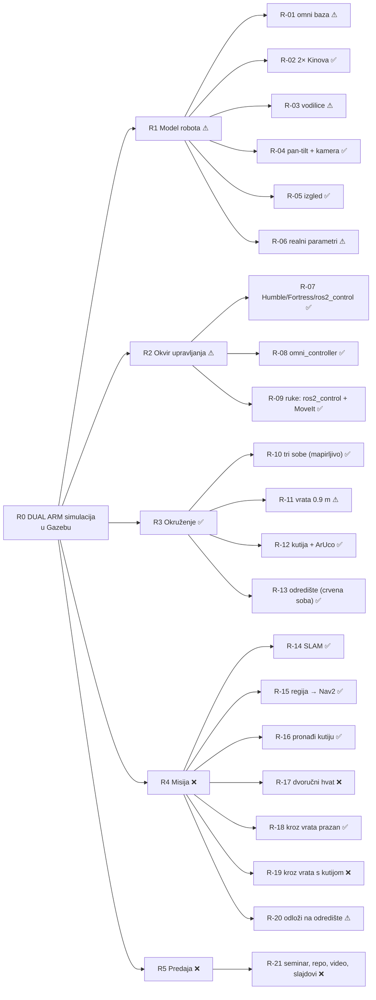

# PAS-DUAL-ARM: mapa projekta (ULAZ)

> [!info] Kako čitati
> Ovo je **ulazna točka**. Stablo ciljeva: svaki list je **zahtjev (R)**. Uz njega stoji **kako
> ga rješavamo (S)**, **što je zapelo (P, s tablicom svih pokušaja)** i **što smo odlučili (D)**.
> **Legenda:** ✅ ispunjeno · ⚠ djelomično · ❌ otvoreno · 🔁 svjesno odstupanje · 🧪 napisano, neprovjereno
> **Izvori:** [ZAD] task.pdf · [MAIL] mail asistenta 4. 5. 2026. · [USM] usmeno, NE obvezuje · [VLAST] naša odluka → [[izvori]]
> **Agenti:** prije bilo kakve izmjene pročitajte [[AGENT_GUIDE]].

## Stanje (14. 9. 2026.)
- **Radi:** robot sam pronađe kocku i dođe do nje (percepcija + prilaz, [[R-16_find_box]]).
- **NE radi:** hvat. Kartica [[R-17_dual_arm_lift]] je do 13. 9. stajala kao ✅ („3 uspješna GUI
  ciklusa 16. 7."); **korisnik je tu ocjenu povukao** — hvat nije dobro napravljen. Iz tog rada je
  zadržana samo ručno namještena poza `ARM_CARRY_V2`.
- **Novo 13. 9.:** svijet s **tri sobe u L** i vratima od 1.0 m, te lagana kutija (0.3 kg)
  ([[D-13_three_room_world]], [[D-14_light_box_free_size]]).
- **Novo 13. 9. (SLAM sesija):** `ARM_CARRY_V2` je u kodu (`postures.py`); lidar više ne vidi
  vlastite SICK kućice; mapiranje ima vlastiti launch, konfiguraciju i autonomnu turu.
  **Nije potvrđeno:** tijekom vožnje ruke se rašire na 1.109 m, a SLAM korekcija skoči
  1.04 m ([[P-37_arm_position_gain_sag]], [[P-11_nav2_slam_drift]]). Karta još nije prihvaćena.
- **Novo 14. 9.:** karta iz runa 44 je prihvaćena; navigacija radi na **zonama izvedenim iz
  detektiranih vrata i stolova** ([[D-16_zones_from_detected_features]]). **Vožnja potvrđena**
  (run 46): ručni cilj → plava soba 33.1 s, `goto red` → pred crvenim stolom 60.6 s; Nav2 vozi
  svaku dionicu, kod vrata su portalne poze i preduvjet.
- **Povučeno 14. 9.:** dva sloja naslagana na run 46 bez ijedne vožnje (zatvoreni tranzit i
  širinski gate) zaustavila su sustav; `main` je vraćen na run 46, kod je na grani
  `wip/door-transit-closed-loop` ([[D-18_verified_baseline_first]], [[P-39_nav2_enters_doorway_at_an_angle]]).
- **Novo 14. 9. (SLAM/lokalizacija):** iz runa 59 je **izračunato** da lidar otvor od 1.00 m
  vidi točno (1.002 m) i robota 7.8 cm od osi, dok AMCL tvrdi da je centriran — greška
  lokalizacije ~7 cm uz budžet od 7.3 cm ([[P-40_amcl_pose_disagrees_with_lidar]]). Karta iz
  runa 44 je snimljena **prije** lidara od 1080 zraka i na rešetki od 0.05 m, pa zid od 0.10 m
  crta 0.15 m debelo i otvor očitava kao 0.950 m. `slam_params.yaml` je na **0.02 m**, dodani
  su `scripts/check_map_geometry.py` (geometrijski gate karte), `loc_error` (debug-only mjerenje
  greške lokalizacije) i telemetrija lidar-vs-poza u navigatoru.
- **Novo 14. 9. (run 60):** **nova karta je prihvaćena** — otvor se očitava kao **0.980 m** (bilo 0.950), os prolaza **0.0 cm** (bilo +1.5), zid 120 mm (bilo 150–178), lica zidova ravna (nagib ≤ 0.02°, RMS ≤ 2.3 mm). Rezerva po strani **4.8 → 6.3 cm** od fizičkih 7.3. Sljedeće: vožnja na novoj karti uz **nepromijenjen** AMCL, pa mjerenje `loc_error`-om.
- **Novo 14. 9. (run 62):** novi AMCL mjerni model → **5/5 prolaza kroz vrata bez aborta**; razlika lidar-vs-AMCL 1.8–3.5 cm izmiješanih predznaka (bilo 4.4–6.0 jednog), a `loc_error` ground truthom mjeri vršnu grešku **3.0 / 2.9 cm i 0.3°** kroz cijeli run, bez rasta. **Vrata su riješena.**
- **Novo 14. 9. (run 63):** zona oko stola **uklonjena** — robot mora doći do stola po kutiju (korisnik). Uz to je nađen stvarni uzrok zapinjanja uz zone: **NavFn planira točku, DWB provjerava otisak**, a nav2 filtere obrađuje nakon plugina pa `inflation_layer` nikad ne napuhne keepout → putanja legalno ide uz sam rub zone, a izvesti je nemoguće. Zone se sad objavljuju u **dvije veličine**: sirova za lokalni costmap (otisak), napuhana za 0.427 m za globalni (točka) ([[P-39_nav2_enters_doorway_at_an_angle]] #21–23).
- **Novo 14. 9. (run 69, potencijalna polja):** jedinstveno potencijalno polje u `nav_zones` ([[D-20_single_potential_field_costmap]]), rampa širine 0.30 m i vrha 35 (razmak putanje 0.715 m od prepreka, optimalno unutar 0.60–0.90 m), brazde nulte cijene kroz prolaze i prilaze stolovima (sprječava zasićenje NavFn potencijala na 253), globalni `inflation_layer` ugašen (`enabled: false`), implementirana dock (10 cm od ploče) i undock (1D vožnja unatrag niz prilaznu os) geometrija.
- **Novo 14. 9. (D-20):** navigacija prešla na **jedno potencijalno polje**. Bila su tri izvora odbijanja oprečne semantike (nav2 `inflation_layer` = tvrda izotropna zabrana, lijevci = binarno, rampa oko stola = cijena); sad `Zones.field` računa cijelu plohu iz karte, a `inflation_layer` je ugašen. **Privlačenje** je izvedeno kao **brazde nulte cijene** kroz prolaze i niz prilaz stolu — na costmapu bez negativnih brojeva prolaz se ne privlači, nego se sve pokraj njega odbija. Dodana **dock** poza: čelo 10.0 cm od ploče, bez okretanja, izlaz unatrag ([[D-20_single_potential_field_costmap]]). Offline provjereno, **čeka vožnju**.
- **Novo 16. 9. (spajanje vožnje i hvata):** vožnja i hvat dosad nisu radili u istom runu — vozilo
  se u `ARM_CARRY_V2` bez tereta, a hvat je uvijek startao sa spawnom na dock pozi. Napisan je
  misijski način (`mission.launch.py`, `main_task mission:=true`, gumb „MISIJA: po kutiju", vožnja
  kroz `room_navigator`) → [[P-45_mission_integration]], upute [[misija]].
- **Novo 16. 9. (run M1, GUI korisnika):** **`DRIVE_V4` je potvrđen kao poza vožnje** — 9 ciljeva,
  3 prolaza kroz vrata bez aborta, gate ruku `worst joint 0.000 rad`, dolasci 2.8–5.0 cm, lidar vs
  AMCL 2.1–3.5 cm. Dock/undock dionica **nije** vožena; vozi je M2 ([[runovi]] M1).
- **Otvoreno (obavezno iz maila):** vožnja kroz vrata uživo, nošenje kroz vrata, odlaganje
  u crvenoj sobi.
- **Redoslijed misije [MAIL]:** mapiraj → regija (plava soba) → pronađi → podigni → nosi kroz vrata
  → odloži u crvenoj sobi. Plan dana: [[danas]]. Iskrena odstupanja: [[odstupanja]].

## R0: Cilj [ZAD]
Izraditi **simulacijski model DUAL ARM robota u Gazebu** sa svim ključnim komponentama (senzori,
aktuatori, upravljanje), s **realističnim kretanjem i interakcijom s okolinom** i parametrima prema
stvarnim specifikacijama. Konkretna misija je iz [MAIL]: *mapiraj → idi u zadanu regiju → nađi
kutiju → podigni je objema rukama → prođi kroz vrata → odloži je na zadano mjesto*.

## R1: Model robota
| Zahtjev | Izvor | Status | Rješenje | Problemi | Odluke |
|---|---|---|---|---|---|
| [[R-01_omni_base]] | MAIL | ⚠ model da, omni pogon ne | [[S-01_robot_description]], [[S-04_base_drive]] | [[P-03_pal_base_classic_control]], [[P-09_omni_drive_on_fortress]] | [[D-03_diff_drive_base_temporary]] |
| [[R-02_kinova_arms]] | MAIL | ✅ | [[S-01_robot_description]] | [[P-05_negative_mesh_scale_dart]] | — |
| [[R-03_linear_rails_torso]] | MAIL | ⚠ model da, ne diže pod teretom | [[S-01_robot_description]] | [[P-13_torso_prismatic_no_lift]], [[D-21_effort_pid_actuator_profile]] | [[D-09_lift_with_arms_not_torso]] |
| [[R-04_pan_tilt_camera]] | MAIL | ✅ | [[S-01_robot_description]], [[S-05_perception]] | [[P-06_classic_only_sensors]] | — |
| [[R-05_visual_match]] | MAIL | ✅ | [[S-01_robot_description]] | [[P-04_mesh_uri_not_found]] | — |
| [[R-06_realistic_parameters]] | ZAD | ⚠ | [[S-01_robot_description]], [[S-03_ros2_control_setup]] | [[P-13_torso_prismatic_no_lift]], [[P-15_dart_friction_no_hold]] | [[D-05_contact_verified_attach]] |

## R2: Okvir upravljanja
| Zahtjev | Izvor | Status | Rješenje | Problemi | Odluke |
|---|---|---|---|---|---|
| [[R-07_ros2_humble_fortress_control]] | ZAD | ✅ | [[S-02_world_and_sim_launch]], [[S-03_ros2_control_setup]], [[S-10_build_run_environment]] | [[P-01_shell_zenoh_contamination]], [[P-02_robot_description_yaml_parse]], [[P-31_apt_upgrade_breakage]], [[P-32_gui_starves_controllers]] | [[D-10_headless_vs_gui]], [[D-11_project_scoped_ros_env]] |
| [[R-08_omni_controller]] | MAIL (obavezno) | ✅ `mecanum_drive_controller`, potvrđen u vožnji (run 70) | [[S-04_base_drive]] | [[P-09_omni_drive_on_fortress]], [[P-10_skid_steer_cannot_turn]] | [[D-03_diff_drive_base_temporary]] (zamijenjena) |
| [[R-09_moveit_arm_control]] | MAIL | ✅ | [[S-03_ros2_control_setup]], [[S-07_moveit_setup]] | [[P-23_moveit_blind_to_world]], [[P-24_press_path_chain]] | — |

## R3: Okruženje (tri sobe u L od 13. 9.)
| Zahtjev | Izvor | Status | Rješenje | Problemi | Odluke |
|---|---|---|---|---|---|
| [[R-10_mappable_world]] | MAIL | ✅ tri sobe (GUI potvrđeno 13. 9.) | [[S-02_world_and_sim_launch]] | [[P-36_walls_lower_than_camera]] | [[D-13_three_room_world]] |
| [[R-11_door_80cm]] | MAIL + korisnik (0.9 m) | ⚠ vrata postoje, prolaz netestiran | [[S-02_world_and_sim_launch]], [[S-06_navigation]] | [[P-12_door_too_narrow]], [[P-35_arm_span_too_wide_for_door]] | [[D-13_three_room_world]] (zamjenjuje [[D-08_door_widened]]) |
| [[R-12_box_with_aruco]] | MAIL (dimenzije slobodne) | ✅ 0.30 m, 0.3 kg | [[S-02_world_and_sim_launch]], [[S-05_perception]] | [[P-08_marker_not_detected_texture]], [[P-14_gripper_too_small_for_cube]] | [[D-01_aruco_dict_4x4_50]], [[D-06_cube_squeeze_grasp]], [[D-14_light_box_free_size]] |
| [[R-13_destination_place]] | MAIL | ✅ `place_table` u crvenoj sobi | [[S-02_world_and_sim_launch]] | — | [[D-13_three_room_world]] |

## R4: Misija
| Zahtjev | Izvor | Status | Rješenje | Problemi | Odluke |
|---|---|---|---|---|---|
| [[R-14_slam_mapping]] | MAIL (obavezno) | ✅ karta runa 60 na 0.02 m novim lidarom; vrata 0.980 m, os 0.0 cm | [[S-06_navigation]] | [[P-11_nav2_slam_drift]] | [[D-04_visual_servo_instead_nav2]] |
| [[R-15_region_goal_nav2]] | MAIL (obavezno) | ✅ vožnja potvrđena u GUI-ju (run 70); greška AMCL-a 3.0/2.9 cm izmjerena | [[S-06_navigation]], [[S-09_task_orchestration]] | [[P-11_nav2_slam_drift]], [[P-33_nav2_undershoot_base_shift]], [[P-39_nav2_enters_doorway_at_an_angle]] (riješen) | [[D-20_single_potential_field_costmap]] |
| [[R-16_find_box]] | MAIL | ✅ | [[S-05_perception]], [[S-09_task_orchestration]] | [[P-07_aruco_dict_and_cv_bridge]], [[P-19_aruco_foreshortening_close]], [[P-20_pointcloud_starves_clock]], [[P-22_depth_self_view_clusters]] | [[D-02_own_aruco_detector]] |
| [[R-17_dual_arm_lift]] | MAIL | ✅ GUI korisnika 16. 9. (run M4, `TASK COMPLETE` unutar pune misije) | [[S-08_grasp_squeeze_attach]], [[S-07_moveit_setup]] | [[P-14_gripper_too_small_for_cube]], [[P-15_dart_friction_no_hold]], [[P-16_fake_teleport_grasp]], [[P-17_detachable_joint_explodes]], [[P-24_press_path_chain]], [[P-25_asymmetric_arm_reach]], [[P-26_one_sided_press_bulldozes]], [[P-27_contact_sensor_topic_ignored]], [[P-28_gate_too_strict]], [[P-41_effort_pid_arm_actuator_profile]], [[P-42_contact_sensor_has_no_forces]], [[P-43_grasp_pose_wider_than_door]], [[P-44_grasp_from_reference_pose]] | [[D-05_contact_verified_attach]], [[D-06_cube_squeeze_grasp]], [[D-07_carry_on_left_wrist]], [[D-12_honesty_abort_over_fake]], [[D-21_effort_pid_actuator_profile]] |
| [[R-18_door_pass_empty]] | MAIL | ✅ 5/5 prolaza u oba smjera kroz oboja vrata (run 62, 70) | [[S-06_navigation]] | [[P-12_door_too_narrow]], [[P-35_arm_span_too_wide_for_door]], [[P-39_nav2_enters_doorway_at_an_angle]] (riješen) | [[D-20_single_potential_field_costmap]] |
| [[R-19_door_pass_with_box]] | MAIL | ✅ GUI 16. 9.: kutija prošla oboja vrata, `arms: CARRY_V4 held` | [[S-06_navigation]], [[S-08_grasp_squeeze_attach]] | [[P-18_transport_drops_box]], [[P-12_door_too_narrow]], [[P-35_arm_span_too_wide_for_door]], [[P-43_grasp_pose_wider_than_door]], [[P-44_grasp_from_reference_pose]], [[P-45_mission_integration]] | [[D-07_carry_on_left_wrist]], [[D-14_light_box_free_size]] |
| [[R-20_place_at_destination]] | MAIL | ✅ GUI 16. 9.: `PLACE VERIFIED: 5 mm od centra markera` na `place_table` | [[S-08_grasp_squeeze_attach]], [[S-09_task_orchestration]] | [[P-18_transport_drops_box]], [[P-29_place_drop_tips_cube]], [[P-30_stale_collision_object]], [[P-45_mission_integration]] | — |

## R5: Predaja (danas)
| Zahtjev | Izvor | Status | Gdje |
|---|---|---|---|
| [[R-21_deliverables]] | korisnik | ❌ | [[danas]], [[seminar_mapa]], [[odstupanja]] |

## Rješenja (podsustavi)
[[S-01_robot_description]] · [[S-02_world_and_sim_launch]] · [[S-03_ros2_control_setup]] ·
[[S-04_base_drive]] · [[S-05_perception]] · [[S-06_navigation]] · [[S-07_moveit_setup]] ·
[[S-08_grasp_squeeze_attach]] · [[S-09_task_orchestration]] · [[S-10_build_run_environment]]

## Ostalo
- Operativne upute: [notes/00_run/README.md](00_run/README.md) (pokretanje, testiranje, izmjene).
- Povijest: [[timeline]], [[runovi]]
- Svi podesivi brojevi: [[06_parametri]]
- Izmjerene poze ruku i njihove dimenzije: [[08_poze]]
- Odluke (ADR): [[D-01_aruco_dict_4x4_50]] … [[D-20_single_potential_field_costmap]]. Popis je u [[AGENT_GUIDE]].
- Vizualno stablo: `00_mapa.canvas`
