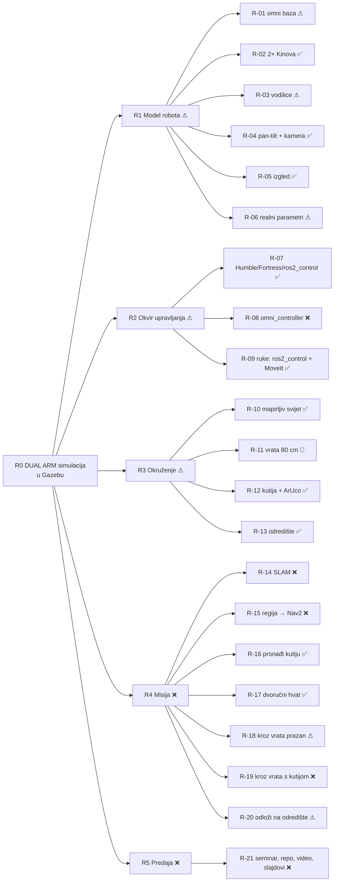

# PAS-DUAL-ARM: mapa projekta (ULAZ)

> [!info] Kako čitati
> Ovo je **ulazna točka**. Stablo ciljeva: svaki list je **zahtjev (R)**. Uz njega stoji **kako
> ga rješavamo (S)**, **što je zapelo (P, s tablicom svih pokušaja)** i **što smo odlučili (D)**.
> **Legenda:** ✅ ispunjeno · ⚠ djelomično · ❌ otvoreno · 🔁 svjesno odstupanje · 🧪 napisano, neprovjereno
> **Izvori:** [ZAD] task.pdf · [MAIL] mail asistenta 4. 5. 2026. · [USM] usmeno, NE obvezuje · [VLAST] naša odluka → [[izvori]]
> **Agenti:** prije bilo kakve izmjene pročitajte [[AGENT_GUIDE]].

## Stanje u jednoj rečenici (13. 9. 2026., zadnji dan)
Robot **sam pronađe kocku, dođe do nje, podigne je objema rukama** (kontaktom verificiran hvat,
3 uspješna GUI ciklusa 16. 7.). **Otvorene su obavezne stavke iz maila:** omni_controller,
SLAM + Nav2, vrata 80 cm te prolaz s kutijom i odlaganje na zadano mjesto. Plan dana je u
[[danas]], a iskren popis odstupanja u [[odstupanja]].

## R0: Cilj [ZAD]
Izraditi **simulacijski model DUAL ARM robota u Gazebu** sa svim ključnim komponentama (senzori,
aktuatori, upravljanje), s **realističnim kretanjem i interakcijom s okolinom** i parametrima prema
stvarnim specifikacijama. Konkretna misija je iz [MAIL]: *mapiraj → idi u zadanu regiju → nađi
kutiju → podigni je objema rukama → prođi kroz vrata od 80 cm → odloži je na zadano mjesto*.

## R1: Model robota
| Zahtjev | Izvor | Status | Rješenje | Problemi | Odluke |
|---|---|---|---|---|---|
| [[R-01_omni_base]] | MAIL | ⚠ model da, omni pogon ne | [[S-01_robot_description]], [[S-04_base_drive]] | [[P-03_pal_base_classic_control]], [[P-09_omni_drive_on_fortress]] | [[D-03_diff_drive_base_temporary]] |
| [[R-02_kinova_arms]] | MAIL | ✅ | [[S-01_robot_description]] | [[P-05_negative_mesh_scale_dart]] | — |
| [[R-03_linear_rails_torso]] | MAIL | ⚠ model da, ne diže pod teretom | [[S-01_robot_description]] | [[P-13_torso_prismatic_no_lift]] | [[D-09_lift_with_arms_not_torso]] |
| [[R-04_pan_tilt_camera]] | MAIL | ✅ | [[S-01_robot_description]], [[S-05_perception]] | [[P-06_classic_only_sensors]] | — |
| [[R-05_visual_match]] | MAIL | ✅ | [[S-01_robot_description]] | [[P-04_mesh_uri_not_found]] | — |
| [[R-06_realistic_parameters]] | ZAD | ⚠ | [[S-01_robot_description]], [[S-03_ros2_control_setup]] | [[P-13_torso_prismatic_no_lift]], [[P-15_dart_friction_no_hold]] | [[D-05_contact_verified_attach]] |

## R2: Okvir upravljanja
| Zahtjev | Izvor | Status | Rješenje | Problemi | Odluke |
|---|---|---|---|---|---|
| [[R-07_ros2_humble_fortress_control]] | ZAD | ✅ | [[S-02_world_and_sim_launch]], [[S-03_ros2_control_setup]], [[S-10_build_run_environment]] | [[P-01_shell_zenoh_contamination]], [[P-02_robot_description_yaml_parse]], [[P-31_apt_upgrade_breakage]], [[P-32_gui_starves_controllers]] | [[D-10_headless_vs_gui]], [[D-11_project_scoped_ros_env]] |
| [[R-08_omni_controller]] | MAIL (obavezno) | ❌ | [[S-04_base_drive]] | [[P-09_omni_drive_on_fortress]], [[P-10_skid_steer_cannot_turn]] | [[D-03_diff_drive_base_temporary]] |
| [[R-09_moveit_arm_control]] | MAIL | ✅ | [[S-03_ros2_control_setup]], [[S-07_moveit_setup]] | [[P-23_moveit_blind_to_world]], [[P-24_press_path_chain]] | — |

## R3: Okruženje
| Zahtjev | Izvor | Status | Rješenje | Problemi | Odluke |
|---|---|---|---|---|---|
| [[R-10_mappable_world]] | MAIL | ✅ | [[S-02_world_and_sim_launch]] | — | — |
| [[R-11_door_80cm]] | MAIL | 🔁 sada 2.0 m | [[S-02_world_and_sim_launch]] | [[P-12_door_too_narrow]] | [[D-08_door_widened]] |
| [[R-12_box_with_aruco]] | MAIL (+USM za dimenzije) | ✅ | [[S-02_world_and_sim_launch]], [[S-05_perception]] | [[P-08_marker_not_detected_texture]], [[P-14_gripper_too_small_for_cube]] | [[D-01_aruco_dict_4x4_50]], [[D-06_cube_squeeze_grasp]] |
| [[R-13_destination_place]] | MAIL | ✅ postoji (`target_table`) | [[S-02_world_and_sim_launch]] | — | — |

## R4: Misija
| Zahtjev | Izvor | Status | Rješenje | Problemi | Odluke |
|---|---|---|---|---|---|
| [[R-14_slam_mapping]] | MAIL (obavezno) | ❌ radilo 23. 6., napušteno | [[S-06_navigation]] | [[P-11_nav2_slam_drift]] | [[D-04_visual_servo_instead_nav2]] |
| [[R-15_region_goal_nav2]] | MAIL (obavezno) | ❌ | [[S-06_navigation]], [[S-09_task_orchestration]] | [[P-11_nav2_slam_drift]], [[P-33_nav2_undershoot_base_shift]] | [[D-04_visual_servo_instead_nav2]] |
| [[R-16_find_box]] | MAIL | ✅ | [[S-05_perception]], [[S-09_task_orchestration]] | [[P-07_aruco_dict_and_cv_bridge]], [[P-19_aruco_foreshortening_close]], [[P-20_pointcloud_starves_clock]], [[P-22_depth_self_view_clusters]] | [[D-02_own_aruco_detector]] |
| [[R-17_dual_arm_lift]] | MAIL | ✅ (16. 7.), 🧪 zadnje izmjene | [[S-08_grasp_squeeze_attach]], [[S-07_moveit_setup]] | [[P-14_gripper_too_small_for_cube]], [[P-15_dart_friction_no_hold]], [[P-16_fake_teleport_grasp]], [[P-17_detachable_joint_explodes]], [[P-24_press_path_chain]], [[P-25_asymmetric_arm_reach]], [[P-26_one_sided_press_bulldozes]], [[P-27_contact_sensor_topic_ignored]], [[P-28_gate_too_strict]] | [[D-05_contact_verified_attach]], [[D-06_cube_squeeze_grasp]], [[D-07_carry_on_left_wrist]], [[D-12_honesty_abort_over_fake]] |
| [[R-18_door_pass_empty]] | MAIL | ⚠ samo 1.2 m, 23. 6. | [[S-06_navigation]] | [[P-12_door_too_narrow]] | [[D-08_door_widened]] |
| [[R-19_door_pass_with_box]] | MAIL | ❌ | [[S-06_navigation]], [[S-08_grasp_squeeze_attach]] | [[P-18_transport_drops_box]], [[P-12_door_too_narrow]] | [[D-07_carry_on_left_wrist]] |
| [[R-20_place_at_destination]] | MAIL | ⚠ samo isti stol | [[S-08_grasp_squeeze_attach]], [[S-09_task_orchestration]] | [[P-18_transport_drops_box]], [[P-29_place_drop_tips_cube]], [[P-30_stale_collision_object]] | — |

## R5: Predaja (danas)
| Zahtjev | Izvor | Status | Gdje |
|---|---|---|---|
| [[R-21_deliverables]] | korisnik | ❌ | [[danas]], [[seminar_mapa]], [[odstupanja]] |

## Rješenja (podsustavi)
[[S-01_robot_description]] · [[S-02_world_and_sim_launch]] · [[S-03_ros2_control_setup]] ·
[[S-04_base_drive]] · [[S-05_perception]] · [[S-06_navigation]] · [[S-07_moveit_setup]] ·
[[S-08_grasp_squeeze_attach]] · [[S-09_task_orchestration]] · [[S-10_build_run_environment]]

## Ostalo
- Povijest: [[timeline]], [[runovi]]
- Svi podesivi brojevi: [[06_parametri]]
- Odluke (ADR): [[D-01_aruco_dict_4x4_50]] … [[D-12_honesty_abort_over_fake]]. Popis je u [[AGENT_GUIDE]].
- Vizualno stablo: `00_mapa.canvas`
