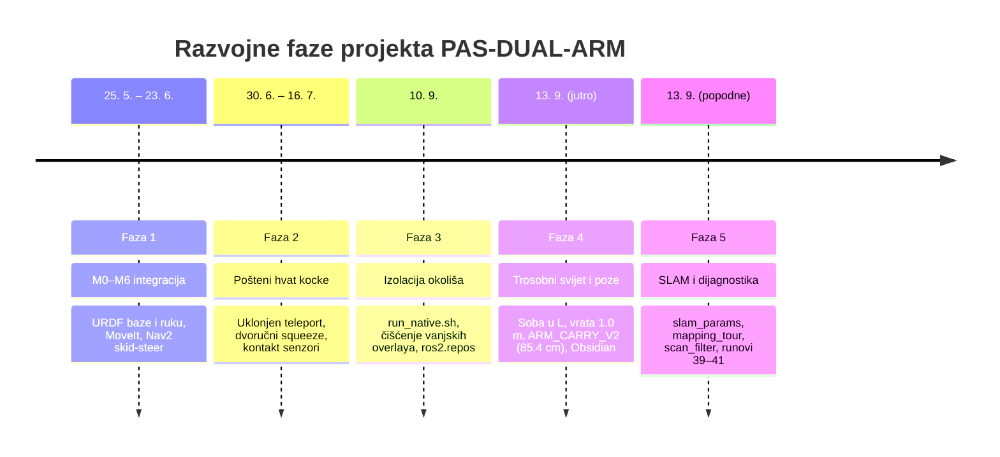

# Pregled radnog prostora i stanja projekta (13. 9. 2026.)

> [!info] Što je ovo
> Sintetički pregled cijelog repozitorija **PAS-DUAL-ARM** na dan 13. 9. 2026. Služi kao jedinstveno
> polazište za razumijevanje organizacije projekta, donesene arhitekture, kronologije rada,
> neriješenih problema i neusklađenih zapisa prije daljnjeg rada na SLAM-u, navigaciji i dovršetku
> zadatka.
> - Za tehnički opis trenutnog stanja koda, hardvera i pokretanja vidi [[02_trenutni_postav_sustava]].
> - Kartice u tekstu linkane su kao Obsidian wikilinkovi (npr. [[00_MAPA]]).
> - Datoteke izvan bilješki linkane su kao relativne Markdown putanje (npr. [run_native.sh](../../scripts/run_native.sh)) s brojevima redaka (`:linija`).

> [!warning] Snimka stanja od 13. 9. 2026.
> Ovo je **povijesni presjek** i namjerno se ne ažurira. Dio datoteka koje spominje više nije u
> repozitoriju (priprema za predaju, 16. 9.): `TASK.md`, `HUMAN.md`, `LINKS.md`, `src/README.md`,
> `STATE.md`, `docs/`, `.ai/` i transkripti sesija. Sve je ostalo lokalno na disku i u git
> povijesti. Aktualne upute: `README.md`, `MAPPING.md`, `RUNNING.md`; aktualna pravila: [[AGENT_GUIDE]].

---

## 1. Kako čitati repozitorij i hijerarhija istine

Pravila rada za sve agente i suradnike definirana su u [AGENT_GUIDE.md](../AGENT_GUIDE.md).

### 1.1 Hijerarhija izvora istine
Kada se u repozitoriju naiđe na kontradiktorne tvrdnje, vrijedi sljedeća stroga hijerarhija:
1. **`[ZAD]` i `[MAIL]`** ([notes/01_zahtjevi/izvori.md](../01_zahtjevi/izvori.md)): formalni tekst zadatka (`task.pdf`) i upute asistenta u mailu od 4. 5. 2026. To su neoborivi zahtjevi.
2. **`D` kartice (Odluke)** ([notes/04_odluke/](../04_odluke/)): važeće inženjerske i arhitektonske odluke. Svako odstupanje od `[ZAD]`/`[MAIL]` mora imati `deviation: true` i biti navedeno u [[odstupanja]].
3. **`P` kartice (Problemi)** ([notes/03_problemi/](../03_problemi/)): izvor istine o neuspjelim pokušajima, anomalijama i ograničenjima simulatora.
4. **`S` kartice (Rješenja / Podsustavi)** ([notes/02_rjesenja/](../02_rjesenja/)): opisi implementiranih mehanizama.
5. **Komentari i stanje u kodu**: često zaostaju za odlukama i nose zastarjele parametre.
6. **Zastarjeli dokumenti** (`TASK.md`, `HUMAN.md`, `src/README.md`, `LINKS.md`, `STATE.md`): povijesna arhiva, ne smiju se koristiti kao smjernice. Od 16. 9. 2026. su izvan repozitorija.

### 1.2 Ključne invarijante sustava (nikad ne kršiti)
- **Nema lažnog uspjeha (poštenje iznad svega):** `attach` kocke na ruku dopušten je isključivo uz fizički dokazan obostrani kontakt s kutijom (`aruco_box`). Nema teleporta i lažnih vezanja iz daljine ([[D-12_honesty_abort_over_fake]]).
- **Nikad dvije krute veze na kocki:** Kocka nakon hvata visi isključivo na lijevom zapešću (`DetachableJoint`), dok desna ruka popušta stisak ([[D-07_carry_on_left_wrist]]). Dvostruka kruta veza ruši DART fizikalni solver.
- **Baza u skid-steeru ne okreće i ne vozi istovremeno:** Zbog niskog bočnog trenja `mu1=0.4, mu2=0.2` (postavljeno na 0.2 radi izbjegavanja numeričkih grešaka nule), simultano translatorno i rotacijsko gibanje uzrokuje masivno bočno bježanje („krabiranje“) ([[P-10_skid_steer_cannot_turn]]).
- **Pacing sim-vremenom:** `spin_once` u ROS 2 nije čekanje na vrijeme; sva čekanja moraju biti vezana uz `/clock` monotonu simulaciju ([[P-21_spin_once_not_pacing_rtf]]).
- **Izolirani okoliš:** Sav build i pokretanje mora ići isključivo preko [scripts/run_native.sh](../../scripts/run_native.sh) ([[D-11_project_scoped_ros_env]]).

---

## 2. Karta „gdje je što“ u workspaceu

| Vrsta informacije | Datoteka / Lokacija | Pouzdanost i uloga |
|---|---|---|
| **Ulaz u sustav bilježaka** | [notes/00_MAPA.md](../00_MAPA.md) | **Glavni indeks**: stablo zahtjeva (R), rješenja (S), problema (P) i odluka (D). Ne linka na debug. |
| **Vodič i pravila za agente** | [notes/AGENT_GUIDE.md](../AGENT_GUIDE.md) | Obavezna pravila, radni proces, popis slijepih ulica, format bilježenja. |
| **Zahtjeevi projekta (R)** | [notes/01_zahtjevi/](../01_zahtjevi/) (`R-01` do `R-21`) | 21 kartica sa zahtjevima iz zadatka, maila asistenta i vlastitih odluka. |
| **Rješenja / Podsustavi (S)** | [notes/02_rjesenja/](../02_rjesenja/) (`S-01` do `S-10`) | 10 kartica koje opisuju implementaciju po tehničkim cjelinama (URDF, MoveIt, hvat...). |
| **Registar problema (P)** | [notes/03_problemi/](../03_problemi/) (`P-01` do `P-38`) | 38 kartica s **tablicama svih dosadašnjih pokušaja**, uzrocima i slijepim ulicama. |
| **Registar odluka (D / ADR)** | [notes/04_odluke/](../04_odluke/) (`D-01` do `D-15`) | 15 arhitektonskih odluka sa statusima (važeća, privremena, zamijenjena, predložena). |
| **Dnevnik svih pokusa** | [notes/05_povijest/runovi.md](../05_povijest/runovi.md) | Kronološki popis svih 41 pokusa (runova) od početka projekta do 13. 9. |
| **Vremenska crta projekta** | [notes/05_povijest/timeline.md](../05_povijest/timeline.md) | Pregled prekretnica po danima razvoja. |
| **Registar parametara** | [notes/06_parametri.md](../06_parametri.md) | **Jedini izvor istine za brojke**: mase, dimenzije, pragovi tolerancija, brzine, doseg. |
| **Plan završnog dana** | [notes/07_predaja/danas.md](../07_predaja/danas.md) | Gap-analiza i prioritetni redoslijed koraka dogovorenih za dan predaje (13. 9.). |
| **Evidencija odstupanja** | [notes/07_predaja/odstupanja.md](../07_predaja/odstupanja.md) | Popis formalnih odstupanja od zadatka s inženjerskim opravdanjima za seminar. |
| **Struktura seminara** | [notes/07_predaja/seminar_mapa.md](../07_predaja/seminar_mapa.md) | Preslikavanje kartica i postignuća u poglavlja završnog seminarskog rada. |
| **Registar poza ruku** | [notes/08_poze.md](../08_poze.md) | Točni zglobni kutovi i izmjerene širine robota (`ARM_CARRY_V2` = 85.4 cm). |
| **Operativne upute za rad** | [notes/00_run/](../00_run/) (`01_pokretanje.md`, itd.) | Naredbe za pokretanje terminala 1–4, testiranje dionica i uvođenje izmjena. |
| **SLAM plan i dizajn** | `docs/MAPPING_LOCALIZATION.md` (lokalno, izvan repoa od 16. 9.) | Codexov dizajn SLAM filtriranja, autonomne ture i registracije objekata. Aktualni postupak: [MAPPING.md](../../MAPPING.md). |
| **Sesijska primopredaja** | `STATE.md` (lokalno, izvan repoa od 16. 9.) | Sažetak stanja na razini repozitorija na kraju sesija. |
| **Brze upute za pokretanje** | [README.md](../../README.md), [MAPPING.md](../../MAPPING.md), [RUNNING.md](../../RUNNING.md) | Instalacija, misija iz jedne naredbe, mapiranje od nule, rad po terminalima. |
| **Transkripti sesija 13. 9.** | Korijenski `.md` i `.txt` fajlovi (lokalno, nikad u repou) | Transkripti Codexove SLAM sesije i Claudeove pripremne sesije. |

---

## 3. Popis svih kartica (R, S, P, D)

### 3.1 Zahtjevi (21 kartica: R-01 … R-21)
| Kartica | Izvor | Status | Sažetak |
|---|---|---|---|
| [[R-01_omni_base]] | MAIL | ⚠ djelomično | PAL omni baza (fizički model prisutan, privremeno se vozi kao diff-drive skid-steer). |
| [[R-02_kinova_arms]] | MAIL | ✅ ispunjeno | 2× Kinova Gen3 7-DOF ruke montirane na klinaste nosače pod 45°. |
| [[R-03_linear_rails_torso]] | MAIL | ⚠ djelomično | Dva prizmatična klizača torza (hod 0.65 m); ne dižu se pod teretom ruku ([[P-13_torso_prismatic_no_lift]]). |
| [[R-04_pan_tilt_camera]] | MAIL | ✅ ispunjeno | Pan-tilt mehanizam s Intel RealSense D435 RGB-D kamerom. |
| [[R-05_visual_match]] | MAIL | ✅ ispunjeno | Vizualna usklađenost modela sa slikom stvarnog robota (materijali, položaji zglobova). |
| [[R-06_realistic_parameters]] | ZAD | ⚠ djelomično | Realne mase, trenja i dinamički parametri prema specifikacijama proizvođača. |
| [[R-07_ros2_humble_fortress_control]] | ZAD | ✅ ispunjeno | ROS 2 Humble + Gazebo Fortress + `ign_ros2_control` (čist build na `/opt/ros/humble`). |
| [[R-08_omni_controller]] | MAIL | ❌ otvoreno | Upravljanje bazom preko obaveznog omnidirekcijskog kontrolera (čeka implementaciju). |
| [[R-09_moveit_arm_control]] | MAIL | ✅ ispunjeno | Upravljanje rukama putem MoveIt 2 okvira (`both_arms`, `left_arm`, `right_arm`). |
| [[R-10_mappable_world]] | MAIL | ✅ ispunjeno | Tri sobe u L (HOME, PLAVA, CRVENA), zidovi 3.0 m, prolazi 1.0 m, mapirljivo 360° lidarom. |
| [[R-11_door_80cm]] | MAIL | ⚠ djelomično | Vrata standardne širine: zadatak traži 0.8 m, prošireno na 1.0 m ([[D-13_three_room_world]]). |
| [[R-12_box_with_aruco]] | MAIL | ✅ ispunjeno | Kocka 0.30 m, masa 0.3 kg, matirani ArUco marker DICT_4X4_50 ID 0. |
| [[R-13_destination_place]] | MAIL | ✅ ispunjeno | Odredišni stol (`place_table`) u crvenoj sobi na koordinatama (6.5, 0.0). |
| [[R-14_slam_mapping]] | MAIL | ❌ otvoreno | Izrada 2D karte svijeta slam_toolboxom (infrastruktura spremna, karta još nije prihvaćena). |
| [[R-15_region_goal_nav2]] | MAIL | ❌ otvoreno | Slanje robota u zadanu regiju (plavu sobu) putem Nav2 stoga. |
| [[R-16_find_box]] | MAIL | ✅ ispunjeno | Autonomni pronalazak kutije vizualnom pretragom (pan-tilt paniranje + ArUco detekcija). |
| [[R-17_dual_arm_lift]] | MAIL | ❌ otvoreno | Podizanje kocke objema rukama (dvoručni squeeze hvat; korisnik povukao staru ocjenu 13. 9.). |
| [[R-18_door_pass_empty]] | MAIL | ⚠ djelomično | Prolazak robota kroz vrata bez tereta (ranije uspjelo samo kroz 1.2 m vrata). |
| [[R-19_door_pass_with_box]] | MAIL | ❌ otvoreno | Prolazak kroz vrata noseći kutiju (blokirano stabilnošću hvata i Nav2 lokalizacijom). |
| [[R-20_place_at_destination]] | MAIL | ⚠ djelomično | Odlaganje na ciljani stol (provjereno spuštanje na isti stol; prijenos u drugu sobu otvoren). |
| [[R-21_deliverables]] | ZAD | ❌ otvoreno | Završni seminar (LaTeX predložak FSB), video demo, prezentacija i čisti repozitorij. |

### 3.2 Rješenja / Podsustavi (10 kartica: S-01 … S-10)
| Kartica | Status | Podsustav | Uloga u sustavu |
|---|---|---|---|
| [[S-01_robot_description]] | ⚠ djelomično | URDF / Xacro | Kompletan kinematski i dinamički opis robota ([robot.urdf.xacro](../../src/pas_dual_arm_bringup/urdf/robot.urdf.xacro)). |
| [[S-02_world_and_sim_launch]] | ⚠ djelomično | Gazebo / SDF | Definicija svijeta ([seminar_world.sdf](../../src/pas_dual_arm_bringup/worlds/seminar_world.sdf)) i [sim.launch.py](../../src/pas_dual_arm_bringup/launch/sim.launch.py). |
| [[S-03_ros2_control_setup]] | ⚠ djelomično | ros2_control | Konfiguracija 8 kontrolera u [controllers.yaml](../../src/pas_dual_arm_bringup/config/controllers.yaml). |
| [[S-04_base_drive]] | 🔁 odstupanje | Pogon baze | Skid-steer vožnja baze preko `diff_drive_controller` i [base_drive.py](../../src/pas_dual_arm_scripts/pas_dual_arm_scripts/base_drive.py). |
| [[S-05_perception]] | ✅ ispunjeno | Percepcija | [aruco_detector.py](../../src/pas_dual_arm_scripts/pas_dual_arm_scripts/aruco_detector.py) (OpenCV ArUco) + dubinska rekonstrukcija. |
| [[S-06_navigation]] | 🔁 odstupanje | Navigacija | Nav2 + slam_toolbox konfiguracija ([nav2_params.yaml](../../src/pas_dual_arm_bringup/config/nav2_params.yaml), [slam_params.yaml](../../src/pas_dual_arm_bringup/config/slam_params.yaml)). |
| [[S-07_moveit_setup]] | ✅ ispunjeno | Manipulacija | MoveIt 2 konfiguracija ([pas_dual_arm_moveit_config](../../src/pas_dual_arm_moveit_config/)). |
| [[S-08_grasp_squeeze_attach]] | ⚠ djelomično | Dvoručni hvat | Squeeze hvat bočnim pritiskom jastučića + DetachableJoint provjera. |
| [[S-09_task_orchestration]] | ⚠ djelomično | Orkestracija | Glavni sekvencer misije ([main_task.py](../../src/pas_dual_arm_scripts/pas_dual_arm_scripts/main_task.py)). |
| [[S-10_build_run_environment]] | ✅ ispunjeno | Okoliš | Čisti hermetički build i run okoliš ([run_native.sh](../../scripts/run_native.sh), [ros2.repos](../../ros2.repos)). |

### 3.3 Problemi (38 kartica: P-01 … P-38)
| Kartica | Status | Broj pokušaja | Ishod zadnjeg pokušaja / Zaključak |
|---|---|---|---|
| [[P-01_shell_zenoh_contamination]] | riješeno | 3 pokušaja | `run_native.sh` sanitizira sve varijable okoline i sprječava Zenoh rušenja. |
| [[P-02_robot_description_yaml_parse]] | riješeno | 4 pokušaja | `robot_description` se prosljeđuje kao string, izbjegnut pogrešan YAML parser. |
| [[P-03_pal_base_classic_control]] | zaobiđeno | 3 pokušaja | Izbačen PAL-ov klasični kontroler; baza prebačena na `ign_ros2_control`. |
| [[P-04_mesh_uri_not_found]] | riješeno | 2 pokušaja | Ispravljene ROS package URI putanje mesheva za Ignition Fortress. |
| [[P-05_negative_mesh_scale_dart]] | riješeno | 2 pokušaja | Regexom u launchu uklonjene negativne skale koje ruše DART fiziku. |
| [[P-06_classic_only_sensors]] | riješeno | 3 pokušaja | Senzori rekonfigurirani na nativne Ignition Fortress senzore (`gpu_lidar`, `rgbd`). |
| [[P-07_aruco_dict_and_cv_bridge]] | riješeno | 2 pokušaja | Izbačen nekompatibilni `aruco_ros`/`cv_bridge`; implementiran nativni OpenCV čvor. |
| [[P-08_marker_not_detected_texture]] | riješeno | 3 pokušaja | Matirana tekstura markera u SDF-u (`roughness=1.0`, `metalness=0.0`). |
| [[P-09_omni_drive_on_fortress]] | otvoreno | 6 pokušaja | Fortress odbija pluginove mecanum pogona; baza privremeno na skid-steeru. |
| [[P-10_skid_steer_cannot_turn]] | zaobiđeno | 4 pokušaja | Postavljeno bočno trenje `mu2=0.2` (minimalni otpor umjesto nule); zabranjena simultana rotacija i vožnja. |
| [[P-11_nav2_slam_drift]] | otvoreno | 6 pokušaja | Pri okretu u mjestu odometrija korigirana (−89.9°), ali pravocrtna vožnja bježi (1.89 m umjesto 4.5 m, map→odom skok 1.04 m). |
| [[P-12_door_too_narrow]] | neprovjereno | 7 pokušaja | Vrata proširena na 1.0 m; prolazak s novom carry pozom čeka validaciju. |
| [[P-13_torso_prismatic_no_lift]] | zaobiđeno | 4 pokušaja | Klizači torza ne dižu teret; podizanje prebačeno na zglobove ruku ([[D-09_lift_with_arms_not_torso]]). |
| [[P-14_gripper_too_small_for_cube]] | riješeno | 6 pokušaja | Robotiq 2F-85 (85 mm) ne obuhvaća kocku 0.3 m; primijenjen dvoručni bočni pritisak. |
| [[P-15_dart_friction_no_hold]] | zaobiđeno | 4 pokušaja | DART trenje ne drži kocku; uveden kontaktom verificiran `DetachableJoint`. |
| [[P-16_fake_teleport_grasp]] | riješeno | 4 pokušaja | Uklonjen teleport; attach se aktivira tek nakon dokazanog obostranog kontakta. |
| [[P-17_detachable_joint_explodes]] | riješeno | 6 pokušaja | Nakon attacha desna ruka popušta; uklonjena prepobuda dviju krutih veza. |
| [[P-18_transport_drops_box]] | otvoreno | 4 pokušaja | Gibanje baze izbacuje kutiju; potrebno ispitati utjecaj brzine i položaja ruku. |
| [[P-19_aruco_foreshortening_close]] | riješeno | 3 pokušaja | Prilaz markeru do 0.95 m, a zadnji dovoz i mjerenje idu dubinskom kamerom. |
| [[P-20_pointcloud_starves_clock]] | riješeno | 2 pokušaja | Optimizirana obrada oblaka točaka; spriječeno izgladnjivanje `/clock` callbacka. |
| [[P-21_spin_once_not_pacing_rtf]] | riješeno | 3 pokušaja | Sve petlje čekanja vezane na sim-vrijeme i monotonu odometriju. |
| [[P-22_depth_self_view_clusters]] | riješeno | 5 pokušaja | Mjerenje kocke s distance od 0.95 m kako kamera ne bi vidjela vlastito tijelo. |
| [[P-23_moveit_blind_to_world]] | riješeno | 2 pokušaja | Dodana kolizijska tijela stola i poda u MoveIt planning scenu. |
| [[P-24_press_path_chain]] | riješeno | 11 pokušaja | Press putanja riješena kartezijskom linijom, unwrapom zglobova i settle-waitom. |
| [[P-25_asymmetric_arm_reach]] | riješeno | 4 pokušaja | Baza se centrira na asimetričnu točku y≈−0.075 m radi preklapanja dosega ruku. |
| [[P-26_one_sided_press_bulldozes]] | riješeno | 3 pokušaja | Naredba za press šalje se simultano na oba JTC kontrolera. |
| [[P-27_contact_sensor_topic_ignored]] | riješeno | 4 pokušaja | Dugi gz topici mapirani u `bridge.yaml` na ROS topice `/contact/...`. |
| [[P-28_gate_too_strict]] | neprovjereno | 4 pokušaja | Ublažen placement uvjet (dopušteno odstupanje 12 cm uz box-only kontakt). |
| [[P-29_place_drop_tips_cube]] | neprovjereno | 3 pokušaja | Spuštanje kocke na stol s interferencijskim pragom (−2 cm u plohu stola). |
| [[P-30_stale_collision_object]] | neprovjereno | 2 pokušaja | Kolizijski objekt kocke briše se iz scene odmah nakon attacha. |
| [[P-31_apt_upgrade_breakage]] | riješeno | 4 pokušaja | Okoliš očišćen od vanjskih buildova; sve vraćeno na čiste pakete Ubuntua 22.04. |
| [[P-32_gui_starves_controllers]] | zaobiđeno | 4 pokušaja | Pokretanje `headless:=true` za stabilno automatsko testiranje bez pada kontrolera. |
| [[P-33_nav2_undershoot_base_shift]] | otvoreno | 2 pokušaja | Baza staje kraće od cilja; trzaj ruku pri planiranju pomiče bazu. |
| [[P-34_source_provenance]] | riješeno | 2 pokušaja | Pinani točni commitovi repozitorija u `ros2.repos` i praćene lokalne zakrpe. |
| [[P-35_arm_span_too_wide_for_door]] | otvoreno | 20 pokušaja | Izmjerena statička poza `ARM_CARRY_V2` (85.4 cm), ali u vožnji progib širi ruke na 1.109 m. |
| [[P-36_walls_lower_than_camera]] | riješeno | 4 pokušaja | Zidovi podignuti s 1.2 m na 3.0 m da kamera ne vidi preko njih. |
| [[P-37_arm_position_gain_sag]] | otvoreno | 6 pokušaja | Zglobovi ruku nemaju holding gain u `ign_ros2_control`; popušta lijevi `j6` (0.614 rad). |
| [[P-38_spontaneous_box_motion]] | otvoreno | 1 pokušaj | Kutija izletjela na (−6.24, 3.30); uzrok je neposlani detach pri spawnu ([[02_trenutni_postav_sustava]] §13.1). |

### 3.4 Odluke (15 kartica: D-01 … D-15)
| Kartica | Status | Odstupanje | Donesena odluka i obrazloženje |
|---|---|---|---|
| [[D-01_aruco_dict_4x4_50]] | važeća | `false` | Odabran standardni rječnik `DICT_4X4_50`, marker ID 0. |
| [[D-02_own_aruco_detector]] | važeća | `false` | Vlastiti `cv2.aruco` čvor umjesto `aruco_ros` zbog fleksibilnosti i stabilnosti. |
| [[D-03_diff_drive_base_temporary]] | privremena | `true` | Privremena vožnja baze kao skid-steer preko `diff_drive_controller` dok se ne riješi omni. |
| [[D-04_visual_servo_instead_nav2]] | privremena | `true` | Visual servo direktno na marker kutije korišten u srpnju radi zaobilaženja driftanja SLAM-a. |
| [[D-05_contact_verified_attach]] | važeća | `true` | `DetachableJoint` se pali tek nakon obostranog senzorskog dodira; fizikalno opravdano. |
| [[D-06_cube_squeeze_grasp]] | važeća | `false` | Zadržana kocka 0.3 m uz dvoručni bočni squeeze hvat zatvorenim hvataljkama. |
| [[D-07_carry_on_left_wrist]] | važeća | `false` | Nakon attacha desna ruka popušta; teret nosi samo lijevi zglob kako se ne bi rušio DART. |
| [[D-08_door_widened]] | zamijenjena | `true` | Ranije proširenje vrata (1.2 m → 2.0 m); zamijenjeno novim trosobnim svijetom [[D-13_three_room_world]]. |
| [[D-09_lift_with_arms_not_torso]] | važeća | `true` | Podizanje tereta zglobovima ruku (+15 cm gore), jer se klizači torza ne dižu pod teretom. |
| [[D-10_headless_vs_gui]] | važeća | `false` | Headless način za brza i pouzdana automatska testiranja; GUI samo za završnu vizualnu potvrdu. |
| [[D-11_project_scoped_ros_env]] | važeća | `false` | Potpuno izoliran projektni ROS shell kroz [scripts/run_native.sh](../../scripts/run_native.sh). |
| [[D-12_honesty_abort_over_fake]] | važeća | `false` | Pošteni prekid rada (abort) uvijek ima prednost pred lažnim prikazivanjem uspjeha. |
| [[D-13_three_room_world]] | važeća | `false` | Novi svijet s tri sobe u L (6×6 m, prolazi 1.0 m, stolovi na fiksnim pozicijama). |
| [[D-14_light_box_free_size]] | važeća | `false` | Kutija 0.30 m olakšana na 0.3 kg („šuplja plastika“) radi stabilnosti u simulatoru. |
| [[D-15_door_transit_behaviour]] | predložena | `false` | Prijedlog determinističkog provlačenja kroz vrata na temelju registriranih značajki. |

---

## 4. Kronologija projekta kroz git commitove (48 commitova)

Razvoj projekta tekao je kroz 5 prepoznatljivih faza (od `5d0eca0` do `cb9f459`):



### Faza 1: Početna integracija sustava (M0 do M6, 25. 5. – 23. 6. 2026.)
- **Commitovi `5d0eca0` … `c5dc31b` … `eee79c4`:** Uspostavljen osnovni repozitorij, podešena geometrija torza s klinastim nosačima pod 45°, usklađen vizualni model sa stvarnim robotom ([[R-05_visual_match]]).
- **Commitovi `M0`–`M6` (lipanj):** Podignut `ros2_control` u Gazebo Fortressu, integrirani 360° lidar i RealSense kamera, konfiguriran MoveIt 2 za dvoručnu manipulaciju, implementiran detektor markera i početni Nav2 slijed. Prolaz kroz vrata postignut samo uz umjetno proširenje prolaza na 1.2 m ([[D-08_door_widened]]).

### Faza 2: Pošten, kontaktom verificiran hvat (kraj lipnja – 16. 7. 2026.)
- **Commit `90e7638` (30. 6.):** Prijelaz s Nav2 navigacije na direct `cmd_vel` vizualno vođenje zbog driftanja skid-steera ([[D-04_visual_servo_instead_nav2]]). Uklonjen lažni teleport kocke; uveden `DetachableJoint` s obostranom kontaktom potvrdom ([[D-05_contact_verified_attach]]).
- **Commit `c504720` (15./16. 7.):** Prelazak s tanke šipke na punu kocku 0.3 m po zadatku. Razvijena kartezijska press-putanja s 2π unwrapom zglobova i sinkroniziranim pritiskom zatvorenim hvataljkama ([[S-08_grasp_squeeze_attach]]).
- **Commit `73617e8` (16. 7.):** Dodano spuštanje s kontaktom pri odlaganju, uklanjanje kolizijskog objekta kocke nakon hvata i eksperimentalni parametar `probe_transport`.

### Faza 3: Izolacija projektnog okoliša (10. 9. 2026.)
- **Commitovi `31df80e` … `ebd392e` … `f046e98`:** Riješen slom okoliša uzrokovan sistemskim `apt upgradeom` ([[P-31_apt_upgrade_breakage]]). Kreiran [scripts/run_native.sh](../../scripts/run_native.sh) koji strogo čisti varijable okoline (Zenoh, tuđi workspaceovi) i forsira Fast DDS, domenu 5 i localhost. Upstream paketi pinani u [ros2.repos](../../ros2.repos).

### Faza 4: Trosobni svijet, mjerenje dimenzija i Obsidian bilješke (13. 9. 2026., jutro)
- **Commitovi `5f6d016` … `2bda09e` … `7f24fbd` … `cb9f459`:**
  - Uvedena kompletna baza znanja u `notes/` (21 R, 10 S, 36 P, 15 D kartica).
  - Kreiran novi svijet s tri sobe u L (HOME, PLAVA, CRVENA), 6×6 m, zidovi podignuti na 3.0 m, prolazi 1.0 m, kocka olakšana na 0.3 kg ([[D-13_three_room_world]], [[D-14_light_box_free_size]]).
  - Izmjerene stvarne dimenzije robota: u novoj pozi `ARM_CARRY_V2` robot je širok **85.4 cm**, dug 1.04 m, visok 1.45 m ([notes/08_poze.md](../08_poze.md)).
  - Hod klizača torza ograničen s 0.80 m na **0.65 m**.

### Faza 5: Rad na SLAM-u i dijagnostici (13. 9. 2026., popodne — necommitano)
- Rad u Codex sesiji ([codex-session-01a09ab7-9afc-7c12-ba44-4ea63f4760d7.md](../../codex-session-01a09ab7-9afc-7c12-ba44-4ea63f4760d7.md)) na osposobljavanju slam_toolboxa, filtriranju laserskog skena i autonomnoj turi. Promjene su ostale necommitane zbog dinamičkih anomalija uočenih u pokusima 39–41.

---

## 5. Codex SLAM sesija — detaljna dekonstrukcija

### 5.1 Što je traženo
Korisnik je zatražio osposobljavanje SLAM-a, lokalizacije, registracije objekata (vrata, stolovi, kutija) i autonomne navigacije:
> *„trenutacni korak je osposobljavanej slama i registracija prolaza, stolova, kutije. i priprema za navigaciju... nemoj slipo nastaviti vec prvo provjeri smislenost plana i implementacija, ogranicenja... nemoj zavrstii dok se ne napravi uspjesna voznja“*

### 5.2 Što je napravljeno
Codex je postavio plan u [docs/MAPPING_LOCALIZATION.md](../../docs/MAPPING_LOCALIZATION.md) i implementirao:
1. **[scan_filter.py](../../src/pas_dual_arm_scripts/pas_dual_arm_scripts/scan_filter.py):** filtrira laserske zrake unutar pravokutnika 1.5 × 0.94 m oko baze kako lidar ne bi vidio vlastito tijelo robota.
2. **[mapping.launch.py](../../src/pas_dual_arm_bringup/launch/mapping.launch.py) & [slam_params.yaml](../../src/pas_dual_arm_bringup/config/slam_params.yaml):** zaseban launch za mapiranje koji pokreće `scan_filter`, `slam_toolbox` u online-async načinu, `feature_registry` i RViz.
3. **[mapping_tour.py](../../src/pas_dual_arm_scripts/pas_dual_arm_scripts/mapping_tour.py):** autonomna tura koja postavlja pozu `ARM_CARRY_V2` i sekvencijalno vozi kroz sve tri sobe.
4. **[feature_registry.py](../../src/pas_dual_arm_scripts/pas_dual_arm_scripts/feature_registry.py):** čvor koji registrira prolaze, stolove i kutiju te objavljuje markere i `tf_static`.
5. **[base_drive.py](../../src/pas_dual_arm_scripts/pas_dual_arm_scripts/base_drive.py) & [set_posture.py](../../src/pas_dual_arm_scripts/pas_dual_arm_scripts/set_posture.py):** modularizirani pogonski mehanizam i servisno postavljanje poza.
6. **Alati za verifikaciju:** [scripts/verify_environment.sh](../../scripts/verify_environment.sh), [scripts/save_map.sh](../../scripts/save_map.sh), [scripts/check_map.py](../../scripts/check_map.py) i mapa [notes/00_run/](../00_run/).

### 5.3 Svi pokusi i izmjereni brojevi (Runovi 39, 40, 41)
Podaci iz [notes/05_povijest/runovi.md](../05_povijest/runovi.md) i transkripta sesije:

1. **Run 39 (Headless provjera okreta i vožnje):**
   - *Probni okret u mjestu:* Naređeno −90.0°, odometrijski izmjereno **−89.9°** (kutno praćenje je vrlo točno).
   - *Pravocrtna dionica:* Naređeno 4.5 m ravno po X osi. Robot se zaustavio nakon samo **1.89 m** (manjak od 58%).
   - *SLAM poremećaj:* Odometrijski i SLAM okvir su se razišli — `map → odom` transformacija skočila je za **1.04 m**, što je uzrokovalo pojavu paralelnih dvostrukih „duhova“ zidova u karti HOME sobe.
2. **Run 40 (Provjera geometrije u pokretu):**
   - Poza `ARM_CARRY_V2` naređena preko MoveIt-a. Nakon kretanja baze izmjereni su kolizijski meshovi alatom `mesh_extent.py`.
   - Statička širina poze je 0.854 m, ali pod utjecajem dinamike i gravitacije ruke su se opustile na **1.109 m** (vrh lijevog prsta na y=0.537 m).
   - Budući da su vrata široka 1.0 m, robot u ovom stanju **fizički ne može proći kroz vrata**. Codex je uveo sigurnosni prekid koji zaustavlja vožnju ako zglobovi odstupe više od praga.
3. **Run 41 (Korisnički GUI run s mapping_tour):**
   - Pokrenuti terminali 1–3 (sim, mapping, move_group). Pri pokretanju terminala 4 (`mapping_tour`), dogodila su se dva povezana kvara:
     - **Katapultiranje kocke:** Kocka na stolu u plavoj sobi na (0, −6.38, 0.25) naglo se pokrenula i izletjela iz prostorije na približno `(−6.24, 3.30)` m ([[P-38_spontaneous_box_motion]]).
     - **Prekid ture na lijevoj ruci:** MoveIt je javio uspjeh planiranja poze, ali 5 sekundi nakon otpuštanja kontrolera stvarni `left_joint_6` odstupao je za **+0.614 rad** (preko 35°). Sigurnosna provjera je prekinula turu prije nego što je baza uopće dobila brzinsku naredbu ([[P-37_arm_position_gain_sag]]).

### 5.4 Dijagnostička karta u `/tmp/pas-map-diagnostic/`
Karta spremljena iz ovog pokušaja ostavljena je u `/tmp/pas-map-diagnostic/` (`seminar_map.pgm`, `seminar_map.yaml`, `seminar_map.posegraph`, `seminar_map.data`).
Pokretanje alata za provjeru:
```bash
python3 scripts/check_map.py /tmp/pas-map-diagnostic/seminar_map.yaml
# Ispis: free area 38.5 m²; observed span 12.0 × 11.8 m
# REJECTED: incomplete three-room coverage
```
Karta ima samo HOME sobu (s dvostrukim zidovima pomaknutim 1 m) i lepezu zraka kroz vrata. U [maps/](../../src/pas_dual_arm_bringup/maps/) nema prihvaćene karte. Datoteke u `/tmp/` nestaju gašenjem računala.

---

## 6. Katalog proturječja i zastarjelih zapisa

Prilikom analize radnog prostora uočene su sljedeće konkretne neusklađenosti:

| # | Tema proturječja | Lokacija A | Lokacija B | Stvarno stanje i objašnjenje |
|---|---|---|---|---|
| 1 | **Status hvata (R-17)** | [danas.md:20](../07_predaja/danas.md): `✅ (🧪 zadnje izmjene)` | [00_MAPA.md:17,83](../00_MAPA.md): `❌ hvat nije dobar (korisnik, 13. 9.)` | Korisnik je 13. 9. povukao ocjenu da hvat radi. R-17 je **otvoren**. |
| 2 | **Širina prolaza (vrata)** | [izvori.md:8](../01_zahtjevi/izvori.md): `0.8 m` po [ZAD]; [danas.md:17](../07_predaja/danas.md): `0.9 m` | [seminar_world.sdf:13](../../src/pas_dual_arm_bringup/worlds/seminar_world.sdf): `1.0 m`; [STATE.md:258](../../STATE.md): `1.2 m` | U SDF-u su vrata **1.0 m** (proširena u commitu `e99316e`). 0.8 i 0.9 m su zastarjeli zapisi. |
| 3 | **Širina robota u carry pozi** | [danas.md:32](../07_predaja/danas.md): `1.26 m`; `main_task.py`: `~0.6 m` | [08_poze.md:22](../08_poze.md): `85.4 cm`; Run 40 izmjereno: `1.109 m` | Statička poza `ARM_CARRY_V2` je **85.4 cm**, ali u vožnji progib zglobova širi ruke na **1.109 m**. |
| 4 | **Popis odluka u vodičima** | [AGENT_GUIDE.md:78](../AGENT_GUIDE.md) i [00_MAPA.md:103](../00_MAPA.md) završavaju s `D-14` | Postoji datoteka [D-15_door_transit_behaviour.md](../04_odluke/D-15_door_transit_behaviour.md) | Odluka `D-15` je napisana, ali nije uvrštena u popise na dnu vodiča. |
| 5 | **Vezanje kocke pri spawnu** | [robot.urdf.xacro:191](../../src/pas_dual_arm_bringup/urdf/robot.urdf.xacro): `starts_attached="true"` | [mapping.launch.py](../../src/pas_dual_arm_bringup/launch/mapping.launch.py) i [mapping_tour.py](../../src/pas_dual_arm_scripts/pas_dual_arm_scripts/mapping_tour.py) | `DetachableJoint` je kruto spojen pri spawnu; samo `main_task` šalje detach, SLAM tijek **nikada ne šalje detach**. |
| 6 | **Dimenzije filtera i footprinta** | [nav2_params.yaml:27](../../src/pas_dual_arm_bringup/config/nav2_params.yaml): `[0.52, 0.427]...` (1.04 × 0.854 m) | [scan_filter.py:34](../../src/pas_dual_arm_scripts/pas_dual_arm_scripts/scan_filter.py): maska `1.5 × 0.94 m` | Filtar maskira širinu 0.94 m, što propušta raširene ruke (1.109 m) u sken, dok Nav2 misli da je robot 0.854 m. |
| 7 | **Pojačanje klizača torza** | [robot.urdf.xacro:320](../../src/pas_dual_arm_bringup/urdf/robot.urdf.xacro): `gain 20.0`, limit `0.8` | [sim.launch.py:73](../../src/pas_dual_arm_bringup/launch/sim.launch.py): runtime `0.1`, hod `0.65 m` | Plugin ignorira gain u command_interfaceu; hod je u xacro ograničen na 0.65 m, a u ros2_control stoji 0.8 m. |
| 8 | **Status SLAM-a u mapi** | [00_MAPA.md:80](../00_MAPA.md): `❌ radilo 23. 6., napušteno` | [STATE.md:4](../../STATE.md), [MAPPING_LOCALIZATION.md](../../docs/MAPPING_LOCALIZATION.md) | SLAM nije napušten; aktivno se razvija u necommitanom kodu kroz `mapping.launch.py`. |
| 9 | **RViz konfiguracija mapiranja** | [mapping.rviz:165](../../src/pas_dual_arm_bringup/rviz/mapping.rviz) | [mapping.launch.py:53](../../src/pas_dual_arm_bringup/launch/mapping.launch.py) | RViz prikazuje sirovi topic `/scan`, dok `slam_toolbox` sluša filtrirani `/scan_filtered`. |
| 10 | **Zastarjeli docstring u main_task** | [main_task.py:2-26](../../src/pas_dual_arm_scripts/pas_dual_arm_scripts/main_task.py) | [seminar_world.sdf:13](../../src/pas_dual_arm_bringup/worlds/seminar_world.sdf) | Zaglavlje skripte spominje stari svijet: vrata na x=2.0 m, stol na (4, 0), masa kocke 1 kg (u svijetu je 0.3 kg). |

---

## 7. Analiza necommitanog stanja repozitorija

Izlaz `git status --short` na radnom stablu sadrži izmjene nastale u tri različite sesije od 13. 9. 2026.:

```
 Changes not staged for commit:
  M STATE.md                                                    <- Claude jutro + Codex
  M notes/00_MAPA.md                                            <- Claude jutro + Codex
  M notes/01_zahtjevi/R-17_dual_arm_lift.md                     <- Claude jutro (povlačenje ocjene hvata)
  M notes/02_rjesenja/S-10_build_run_environment.md             <- Codex (BATRACS reference)
  M notes/03_problemi/P-11_nav2_slam_drift.md                   <- Codex (runovi 39-40)
  M notes/05_povijest/runovi.md                                 <- Claude jutro + Codex (runovi 39-41)
  M notes/06_parametri.md                                       <- Claude jutro (nove poze i sobe)
  M src/pas_dual_arm_bringup/CMakeLists.txt                     <- Codex (instalacija maps foldera)
  M src/pas_dual_arm_bringup/config/nav2_params.yaml            <- Codex (ispravak global costmapa i footprinta)
  M src/pas_dual_arm_bringup/launch/nav2.launch.py              <- Codex (mapping vs localization način)
  M src/pas_dual_arm_bringup/launch/sim.launch.py               <- Codex (PAS_SIM_CARRY_ARMS podrška)
  M src/pas_dual_arm_bringup/launch/task.launch.py              <- Codex (navigacijski argumenti regije)
  M src/pas_dual_arm_bringup/urdf/robot.urdf.xacro              <- Claude jutro (torzo 0.65m) + Codex (SICK off)
  M src/pas_dual_arm_moveit_config/config/pas_dual_arm.srdf     <- Claude jutro (kolizije torza)
  M src/pas_dual_arm_scripts/package.xml                        <- Codex (sensor_msgs_py, controller_manager_msgs)
  M src/pas_dual_arm_scripts/pas_dual_arm_scripts/main_task.py  <- Codex (import base_drive/postures)
  M src/pas_dual_arm_scripts/setup.py                           <- Codex (entry pointi za nove skripte)
  m src/ros2_kortex                                             <- Zakrpa (apply_patches.sh, uklonjeni isaac tagovi)

 Untracked files:
  ?? 2026-09-13-193932-local-command-...txt                     <- Transkript Claude večernje sesije
  ?? codex-session-01a09ab7-9afc-...md                          <- Transkript Codex sesije
  ?? docs/MAPPING_LOCALIZATION.md                               <- Codex (plan i operativni vodič za SLAM)
  ?? notes/00_run/                                              <- Codex (operativne upute 01, 02, 03, README)
  ?? notes/03_problemi/P-37_arm_position_gain_sag.md            <- Codex (kartica problema progiba ruku)
  ?? notes/03_problemi/P-38_spontaneous_box_motion.md          <- Codex (kartica izlijetanja kocke)
  ?? notes/33_debug/                                            <- Claude večer (02_postav) + sada (01_pregled)
  ?? scripts/check_map.py                                       <- Codex (evaluacija PGM/YAML karte)
  ?? scripts/save_map.sh                                        <- Codex (skripta za spremanje karte)
  ?? scripts/verify_environment.sh                              <- Codex (preflight skripta okoliša)
  ?? src/pas_dual_arm_bringup/config/slam_params.yaml           <- Codex (konfiguracija za slam_toolbox)
  ?? src/pas_dual_arm_bringup/launch/mapping.launch.py          <- Codex (launch za mapiranje)
  ?? src/pas_dual_arm_bringup/maps/                             <- Codex (odredište za finalne karte)
  ?? src/pas_dual_arm_bringup/rviz/mapping.rviz                 <- Codex (RViz konfiguracija za SLAM)
  ?? src/pas_dual_arm_scripts/.../base_drive.py                 <- Codex (izdvojena klasa za vožnju baze)
  ?? src/pas_dual_arm_scripts/.../feature_registry.py           <- Codex (registar prolaza i stolova)
  ?? src/pas_dual_arm_scripts/.../mapping_tour.py               <- Codex (skripta autonomne ture)
  ?? src/pas_dual_arm_scripts/.../postures.py                   <- Codex (registar zglobnih poza)
  ?? src/pas_dual_arm_scripts/.../scan_filter.py                <- Codex (filtriranje laserskog skena)
  ?? src/pas_dual_arm_scripts/.../set_posture.py                <- Codex (čvor za slanje zglobnih poza)
```

---

## 8. Otvorena pitanja i sumnje za debugiranje SLAM-a

Analizom logova, transkripata i koda identificirane su četiri ključne sumnje koje blokiraju uspješan SLAM:

### 8.1 Ključna sumnja #1: `DetachableJoint` drži kutiju za lijevu šaku pri spawnu
- **Mehanizam kvara:**
  U [robot.urdf.xacro:191](../../src/pas_dual_arm_bringup/urdf/robot.urdf.xacro) plugin `DetachableJoint` ima postavljen parametar `starts_attached="true"`.
  Roditeljski link je `left_bracelet_link`, a dijete je `aruco_box`.
  Kutija se u [seminar_world.sdf:80](../../src/pas_dual_arm_bringup/worlds/seminar_world.sdf) spawna na stolu u plavoj sobi na koordinatama `(0.0, −6.38, 0.25)`.
  Robot se spawna u ishodištu `(0.0, 0.0, 0.076)`.
  To znači da je kutija od prve milisekunde **kruto vezana za lijevu ruku preko udaljenosti od 6.4 metra dok istovremeno leži na statičnom stolu**!
- **Posljedice:**
  1. Samo `main_task.py` u svom inicijalnom koraku šalje naredbu `/aruco_box/detach`. Tijekom SLAM pokretanja (`sim.launch.py` + `mapping.launch.py` + `mapping_tour.py`) **nitko nikada ne šalje detach**!
  2. Čim `mapping_tour` pokrene MoveIt planiranje lijeve ruke u pozu `ARM_CARRY_V2`, DART solver pokušava saviti ruku koja je kruto privezana za nepomični stol 6.4 metra dalje.
  3. Solver trpi golemi moment poluge: zglobovi lijeve ruke popuštaju (`left_joint_6` odstupa točno **0.614 rad**, dok slobodna desna ruka drži pozu unutar **0.016 rad** — [[P-37_arm_position_gain_sag]]).
  4. U Runu 41 naprezanje veze katapultira kutiju sa stola u luku oko robota na poziciju `(−6.24, 3.30)` (udaljenost $\sqrt{(-6.24)^2 + 3.30^2} = 7.06\text{ m}$, što točno odgovara radijusu poluge — [[P-38_spontaneous_box_motion]]).
  5. Reakcijske sile preko te nevidljive poluge opterećuju bazu i onemogućuju normalno gibanje ravno.
- **Predloženi test:**
  Prije bilo kakvog pomicanja ruku ili baze u simulaciji poslati naredbu za odvajanje:
  ```bash
  ign topic -t "/aruco_box/detach" --msgtype ignition.msgs.Empty -p " "
  ```
  ili postaviti `starts_attached="false"` u URDF-u za potrebe mapiranja.

### 8.2 Sumnja #2: Zašto pravocrtna vožnja ostvaruje samo 1.89 m umjesto 4.5 m
- **Mogući uzroci:**
  1. Reakcijska sila vezane kocke opisana u §8.1.
  2. Odometrijsko proklizavanje na trenju `mu1=0.4, mu2=0.2`: baza se vrti u prazno ili rano detektira lažni pređeni put.
  3. Prekid petlje u [base_drive.py:100](../../src/pas_dual_arm_scripts/pas_dual_arm_scripts/base_drive.py): provjeriti izračun `trapezoid_drive` vremenskih rampi i uvjeta izlaza iz petlje.
- **Predloženi test:**
  Nakon čistog detacha kocke provesti izolirani pravocrtni test vožnje 1.0 m, 2.0 m i 4.0 m na čistom podu i mjeriti stvarno prevaljeni put u odnosu na `/base_controller/odom`.

### 8.3 Sumnja #3: Progib zglobova ruku pod gravitacijom (`P-37`)
- **Mehanizam:**
  `ign_ros2_control` za `kortex_description` koristi golo sučelje `<command_interface name="position"/>`. Za razliku od torza koji ima proportional gain, zglobovi ruku nemaju aktivno proporcionalno držanje pozicije pod gravitacijom kada kontroler završi trajektoriju.
- **Predloženi test:**
  Provjeriti odstupanje zglobova nakon odvajanja kocke: ako desna ruka drži unutar 0.016 rad, provjeriti drži li i lijeva ruka sličnu toleranciju kada ne vuče kutiju sa stola.

### 8.4 Sumnja #4: Scan filter maska i pojava dvostrukih zidova („duhova“)
- **Mehanizam:**
  [scan_filter.py](../../src/pas_dual_arm_scripts/pas_dual_arm_scripts/scan_filter.py) maskira kutiju širine samo 0.94 m. Ako se ruke opuste na 1.109 m, laserske zrake udaraju u prste robota na y=±0.55 m. Točke prstiju u laserskom skenu rotiraju zajedno s robotom, što SLAM algoritam interpretira kao kretanje zidova i uzrokuje nagli skok `map → odom` transformacije za 1.04 m.
- **Predloženi test:**
  Pregledati `/scan_filtered` u RViz-u tijekom gibanja: osigurati da nijedan dio robota ne ostaje unutar laserskog skena.
