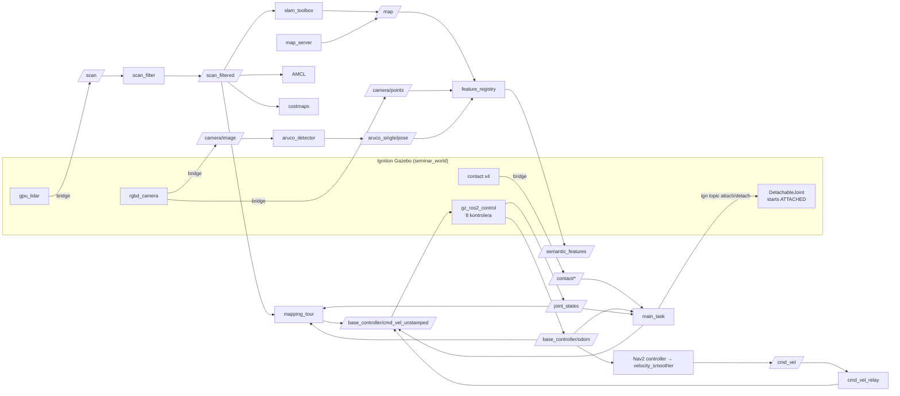
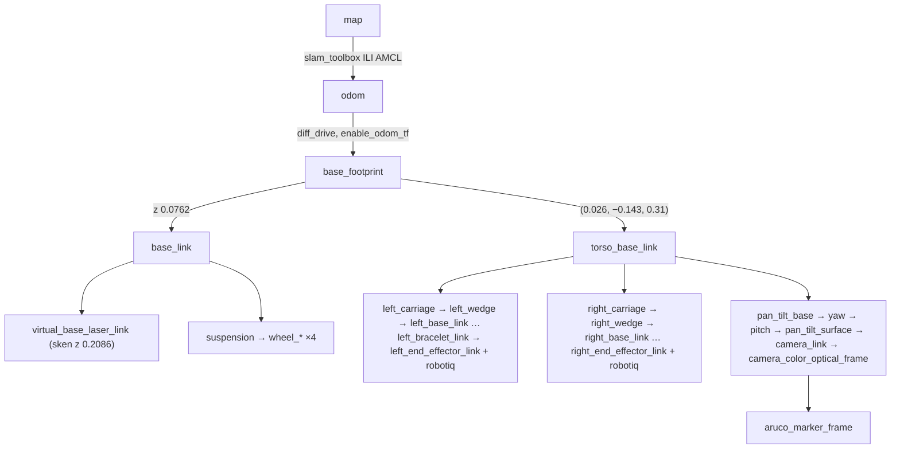

# Trenutni postav sustava (13. 9. 2026., radno stablo s necommitanim izmjenama)

> [!info] Što je ovo
> Točan opis **kako je sustav sada složen**, onako kako leži na disku (uključujući necommitane
> izmjene Claude i Codex sesije od 13. 9.). Svaka vrijednost ima izvor `datoteka:linija`.
> Status zahtjeva i povijest nisu ovdje: to je u [[01_pregled_workspacea]] i [[00_MAPA]].
> 🧪 = napisano, nije potvrđeno runom. ⚠ = poznata nekonzistencija (skupljeno u §13).

**Sažetak u 5 redaka**
- ROS 2 Humble + Ignition Gazebo Fortress (DART), `ros2_control` preko `ign_ros2_control`, MoveIt 2, Nav2, slam_toolbox.
- Robot: PAL omni baza (**vozi se kao diff-drive skid-steer**), torzo s 2 klizača, 2× Kinova Gen3 7-DOF + Robotiq 2F-85, pan-tilt + D435 RGB-D, 360° `gpu_lidar`.
- Svijet: tri sobe 6×6 m u L, prolazi 1.0 m, kutija 0.30 m / 0.3 kg s ArUco markerom na stolu u PLAVOJ sobi.
- SLAM tijek (novo, necommitano): `/scan` → `scan_filter` → `/scan_filtered` → slam_toolbox; autonomna tura `mapping_tour`.
- **Nema spremljene karte** ([maps/](../../src/pas_dual_arm_bringup/maps/) sadrži samo `.gitkeep`). Lokalizacija/Nav2 nisu validirani.

---

## 1. Okoliš (build i pokretanje)

**Instalirane verzije** (apt): Ubuntu 22.04.5, `ros-humble-desktop` 0.10.0, `ignition-fortress` 1.0.3
(Gazebo Sim 6, DART), `ros-humble-ros-gz` 0.244.25, `ros-humble-ign-ros2-control` 0.7.20,
`nav2-bringup` 1.1.20, `slam-toolbox` 2.6.10, `moveit-ros-move-group` 2.5.9. Iz apta (ne iz `src/`):
`omni-base-description` 2.17.0, `pal-urdf-utils` 2.9.1, `robotiq_description`.

**[run_native.sh](../../scripts/run_native.sh)**: jedini ulaz u ROS okoliš ([[D-11_project_scoped_ros_env]], [[S-10_build_run_environment]]).
- l.12 resetira `PATH`; l.13–47 briše ~35 naslijeđenih varijabli (AMENT/CMAKE/COLCON, `LD_*`, `PYTHONPATH`,
  GZ/IGN putanje, RMW, DDS/Zenoh profili…).
- l.57–61 učitava samo `/opt/ros/humble/setup.bash` + `install/local_setup.bash`.
- l.66–69: `RMW_IMPLEMENTATION=rmw_fastrtps_cpp`, `ROS_DOMAIN_ID=${PAS_DUAL_ARM_ROS_DOMAIN_ID:-5}`,
  `ROS_LOCALHOST_ONLY=${PAS_DUAL_ARM_ROS_LOCALHOST_ONLY:-1}`, `PAS_DUAL_ARM_ROOT`.
- l.71–80 prekida ako je u `AMENT_PREFIX_PATH` ičega izvan `/opt/ros/humble` ili `install/`.
- `./scripts/run_native.sh` bez argumenata otvara shell s promptom `(pas-dual-arm)`; s argumentima `exec "$@"`.

**[verify_environment.sh](../../scripts/verify_environment.sh)** (necommitano): sam ulazi kroz `run_native.sh --inside`.
Statičke provjere l.33–51 (humble, Fast DDS, domena 5, localhost, bez stranih overlaya), alati l.53
(`ros2 colcon xacro ign`), paketi l.61–69. `--live` (l.71–78) čeka po jednu poruku na `/clock`,
`/joint_states`, `/scan_filtered`, `/base_controller/odom` (timeout 8 s). **Statički 17/17 prošlo; `--live` nikad pokrenut.**

**Izvori i zakrpe**
- [ros2.repos](../../ros2.repos) pina 5 upstream repozitorija na točan commit: aruco_ros `86a0bbb`,
  omni_base_simulation `77248ac`, pan_tilt_ros `b0f6534`, realsense-ros `6d87b07`, ros2_kortex `116d87a`
  (gitlinkovi bez `.gitmodules`, [[P-34_source_provenance]]).
- [apply_patches.sh](../../scripts/apply_patches.sh) primjenjuje jednu zakrpu
  [ros2_kortex-robotiq_2f_85-drop-isaac-args.patch](../../patches/ros2_kortex-robotiq_2f_85-drop-isaac-args.patch)
  (briše `sim_isaac`/`isaac_*` argumente iz `robotiq_2f_85_macro.xacro`). **Primijenjena je**, zato
  `git status` pokazuje `src/ros2_kortex` kao „modified content“. To je očekivano.
- [requirements.txt](../../requirements.txt): numpy, matplotlib, scipy, open3d, ultralytics, Pillow, opencv-python
  (⚠ open3d/ultralytics/matplotlib ne koristi nijedan čvor).

**Build**: `build/ install/ log/` postoje, 26 paketa. Zadnji build 13. 9. 18:58
(`--packages-select pas_dual_arm_scripts`). `--symlink-install`: izmjene launch/config/urdf datoteka
i Python koda vrijede odmah, **nove datoteke traže rebuild**.

## 2. Paketi u `src/`

| Paket | Vrsta | Uloga | Bitno |
|---|---|---|---|
| `pas_dual_arm_bringup` | vlastiti, ament_cmake | URDF, svijet, launch, config, rviz, karte | [CMakeLists.txt](../../src/pas_dual_arm_bringup/CMakeLists.txt) instalira `launch urdf worlds config rviz maps` (`maps` dodan necommitano) |
| `pas_dual_arm_moveit_config` | vlastiti, ament_cmake | SRDF, kinematika, OMPL, kontroleri za MoveIt | §9 |
| `pas_dual_arm_scripts` | vlastiti, ament_python | svi Python čvorovi | [setup.py](../../src/pas_dual_arm_scripts/setup.py): `aruco_detector`, `cmd_vel_relay`, `main_task` + **novo** `mapping_tour`, `set_posture`, `scan_filter`, `feature_registry`; [package.xml](../../src/pas_dual_arm_scripts/package.xml) novo: `controller_manager_msgs`, `sensor_msgs_py`, `python3-scipy` |
| `dual_arm_torso` | vlastiti | meshevi + URDF torza | [dual_arm_torso.urdf.xacro](../../src/dual_arm_torso/urdf/dual_arm_torso.urdf.xacro) |
| `ros2_kortex` | preuzeti | Kinova Gen3 opis (+ zakrpa) | — |
| `pan_tilt_ros` | preuzeti | pan-tilt opis | — |
| `realsense-ros` | preuzeti | `realsense2_description` (namjerno preklapa apt) | — |
| `aruco_ros` | preuzeti | **ne koristi se** (vlastiti detektor, [[D-02_own_aruco_detector]]) | — |
| `omni_base_simulation` | preuzeti | **ne koristi se** (opis baze je iz apta) | [[P-03_pal_base_classic_control]] |

## 3. Model robota: [robot.urdf.xacro](../../src/pas_dual_arm_bringup/urdf/robot.urdf.xacro)

Argumenti l.5–7: `use_sim_time` (true), `sim_ignition` (true), **`carry_arms` (false, novo)**.

**Baza**
- PAL `omni_base_description` (apt) samo strukturno: `base_sensors.urdf.xacro`. `omni_base.urdf.xacro` se namjerno
  preskače jer nosi Gazebo Classic ros2_control ([[P-03_pal_base_classic_control]]).
- `wheel_radius` 0.0762, `wheel_separation` 0.44715. `base_footprint → base_link` z = 0.0762.
- **Necommitano, l.24–31:** SICK laseri isključeni (`front_laser_model="false" rear_laser_model="false"`).
  Razlog: Classic `gpu_ray` pod Fortressom ništa ne objavljuje, a njihove kućice na (±0.275, ∓0.183, 0.132)
  bile su u ravnini 360° lidara (dvije mrlje od 7 zraka na ~0.31 m). `virtual_base_laser_link` ostaje.
- Trenje kotača l.113–132: `mu1=0.4`, **`mu2=0.2`**, kp 1e6, kd 1000 → baza se okreće klizanjem
  ([[P-10_skid_steer_cannot_turn]], [[P-11_nav2_slam_drift]]).

**Torzo** ([dual_arm_torso.urdf.xacro](../../src/dual_arm_torso/urdf/dual_arm_torso.urdf.xacro))
- Vezan za **`base_footprint`** na (0.026, −0.143, 0.31) (robot.urdf.xacro l.38–40).
- Dva prizmatična klizača (os z), **limit 0.05–0.65 m** (smanjeno s 0.8, `7f24fbd`), effort 1000 N, v 0.5.
- Klizači se pod teretom ruke ne dižu ([[P-13_torso_prismatic_no_lift]], [[D-09_lift_with_arms_not_torso]]).

**Ruke** (l.43–94): `kortex_robot.xacro` / `load_robot`, gen3, 7 DOF, `vision=true`, hvataljka `robotiq_2f_85`.
- Lijeva: prefix `left_`, roditelj `left_wedge_link`, origin (0, 0.060, 0) rpy (−0.785, 0, 0).
- Desna: prefix `right_`, roditelj `right_wedge_link`, origin (0, 0.060, 0) rpy (0.785, 0, π).
- **Necommitano, l.44–52:** `initial_positions`: nule, a uz `carry_arms:=true` vrijednosti `ARM_CARRY_V2`.
  Postavlja se **samo varijablom okoline** `PAS_SIM_CARRY_ARMS=true` ([sim.launch.py:64](../../src/pas_dual_arm_bringup/launch/sim.launch.py)), ne launch argumentom.
- Zglobovi ruku imaju goli `position` command interface **bez pojačanja**. Ruke ne drže pozu pod
  gravitacijom ([[P-37_arm_position_gain_sag]]).

**Hvataljke**: Robotiq 2F-85 (`robotiq_description`, `ign_ros2_control/IgnitionSystem`), `*_robotiq_85_left_knuckle_joint`
position, početno 0.7929 (gotovo zatvorena). Trenje prstiju l.139–155: mu1 = mu2 = 5.0.

**Pan-tilt + kamera**: na `torso_base_link` (0.060, 0.143, 0.956); `pan_tilt_yaw/pitch_joint` ±1.047 rad.
D435 (`camera`) na `pan_tilt_surface`.

**Senzori (Ignition)**
| Senzor | Linija | Parametri | Topic |
|---|---|---|---|
| `base_lidar` `gpu_lidar` | l.211–238 | 10 Hz, 360 uzoraka, [−π, π], raspon **0.12–20 m**, frame `virtual_base_laser_link` | gz `scan` → ROS `/scan` |
| `rgbd_camera` | l.245–270 | 15 Hz, hfov 1.211, 640×480, dubina 0.1–10 m, frame `camera_color_optical_frame` | gz `camera` → `/camera/*` |
| 4× `contact` na vrhovima prstiju | l.164–183 | 50 Hz | Fortress ignorira `<topic>`, vidi §6 ([[P-27_contact_sensor_topic_ignored]]) |

**Ravnina skena** je na z = **0.2086 m** iznad poda (`base_footprint`), [set_posture.py:23](../../src/pas_dual_arm_scripts/pas_dual_arm_scripts/set_posture.py).
Stolovi (ploha 0.10 m) su **ispod** nje i lidar ih ne vidi.

**DetachableJoint** (l.185–202): `left_bracelet_link` ↔ `aruco_box/box_link`, gz topici `/aruco_box/attach` i
`/aruco_box/detach`. ⚠ **Komentar l.191–192: „The joint starts attached, so main_task detaches it at startup“.**
U SLAM tijeku `main_task` se ne pokreće, pa **kutiju nitko ne odspaja** (§13, točka 1).

**ros2_control sustavi**
| Sustav | Linija | Zglobovi | Command / State | Napomena |
|---|---|---|---|---|
| `base_wheels_system` | l.281 | 4 kotača | velocity / position, velocity | — |
| `torso_system` | l.307 | 2 klizača | position (min 0.05, **max 0.8** ⚠ l.319) / position (init 0.05), velocity | `position_proportional_gain` 20.0 (l.320) ⚠ plugin ga vjerojatno ne čita |
| `pan_tilt_system` | l.340 | yaw, pitch | position / position, velocity | — |
| ruke (kortex) | — | 7 po ruci | position / position, velocity, effort | bez gaina |
| hvataljke | — | knuckle | position / position, velocity | — |

Gazebo plugin l.363: `ign_ros2_control-system`, parametri iz [controllers.yaml](../../src/pas_dual_arm_bringup/config/controllers.yaml).
Stvarni runtime parametar `/gz_ros2_control/position_proportional_gain` je **0.1** (izmjereno u Codex sesiji, [[P-37_arm_position_gain_sag]] pokušaj 5).

## 4. Svijet: [seminar_world.sdf](../../src/pas_dual_arm_bringup/worlds/seminar_world.sdf)

- Ime svijeta `seminar_world`. Mora ostati takvo jer ga bridge contact topici sadrže.
- Fizika l.14–15: `max_step_size` 0.001, `real_time_factor` 1.0, DART. Pluginovi: Physics, UserCommands,
  SceneBroadcaster, Sensors (ogre2), Contact.

| Soba | Opseg | Boja zidova | Sadržaj |
|---|---|---|---|
| HOME (spawn robota u (0,0), gleda +X) | x∈[−3,3], y∈[−3,3] | siva | — |
| PLAVA | x∈[−3,3], y∈[−9,−3] | plava | `pick_table` + `aruco_box` |
| CRVENA | x∈[3,9], y∈[−3,3] | crvena | `place_table` (odredište) |

- Zidovi (model `rooms`, l.113–197): debljina 0.1 m, **visina 3.0 m**.
- **Prolazi 1.0 m**: HOME↔CRVENA na x = 3, y∈[−0.5, 0.5] (dovratci l.132, l.138);
  HOME↔PLAVA na y = −3, x∈[−0.5, 0.5] (l.146, l.152).
- `pick_table` l.202–204: (0, −6.5), yaw −1.5708, ploha 0.4×0.5 na **z = 0.10**.
- `place_table` l.308–310: (6.5, 0), ploha 0.6×0.6 na z = 0.10.
- `aruco_box` l.235–239: poza (0, −6.38, 0.25), yaw −1.5708, kocka 0.30 m, **0.3 kg**, mu 5.0, kp 3e5.
  Marker (l.284) na lokalnoj −X plohi (gleda prema vratima PLAVE sobe), DICT_4X4_50 id 0, sam marker 0.165 m
  ([[D-01_aruco_dict_4x4_50]], [[D-14_light_box_free_size]]). Kutija prelazi rub stola za ~7 cm.
- Odluka: [[D-13_three_room_world]]. Širina vrata vs zahtjev: [[R-11_door_80cm]], [[P-12_door_too_narrow]].

## 5. Kontroleri: [controllers.yaml](../../src/pas_dual_arm_bringup/config/controllers.yaml)

`controller_manager` `update_rate` **100 Hz** (l.3), `use_sim_time`.

| Kontroler | Tip (linija) | Zglobovi / napomena |
|---|---|---|
| `joint_state_broadcaster` | JointStateBroadcaster (l.7) | — |
| `base_controller` | **diff_drive_controller** (l.28) | lijevi [front_left, rear_left], desni [front_right, rear_right]; `wheel_separation` 0.44715 (l.39), `wheel_radius` 0.0762 (l.40), `base_frame_id` base_footprint (l.42), `enable_odom_tf` true (l.44), `cmd_vel_timeout` 0.5 (l.46), v ≤ 0.6 m/s (l.48), ω ≤ 1.0 rad/s (l.51) |
| `left_arm_controller` / `right_arm_controller` | JointTrajectoryController | `*_joint_1..7`, command position |
| `torso_controller` | JointTrajectoryController | 2 klizača |
| `pan_tilt_controller` | JointTrajectoryController | yaw, pitch |
| `left_/right_gripper_controller` | GripperActionController | knuckle, `allow_stalling` true |

Nigdje nema PID pojačanja. Spawneri: [sim.launch.py](../../src/pas_dual_arm_bringup/launch/sim.launch.py) l.108–128, svih 8,
`--controller-manager-timeout 120`. **omni_controller ne postoji** ([[R-08_omni_controller]], [[D-03_diff_drive_base_temporary]]).

## 6. Bridge: [bridge.yaml](../../src/pas_dual_arm_bringup/config/bridge.yaml)

Sve je GZ → ROS:
| ROS topic | Linija | Tip |
|---|---|---|
| `/clock` | l.2 | Clock |
| `/scan` | l.12 | LaserScan |
| `/camera/image`, `/camera/camera_info`, `/camera/depth_image`, `/camera/points` | l.18–39 | Image, CameraInfo, Image, PointCloud2 |
| `/contact/{left_left,left_right,right_left,right_right}_tip` | l.50–69 | `ros_gz_interfaces/Contacts`, iz dugih putanja `/world/seminar_world/model/dual_arm_robot/link/…/contact` |

**Nema** bridgea za cmd_vel, odom ni TF: te stvari rade kroz `gz_ros2_control` (diff_drive objavljuje
`/base_controller/odom` i TF `odom → base_footprint`). Attach/detach kutije ide čistim Ignition topicima.

## 7. Launch datoteke

| Launch | Argumenti | Što pokreće | Necommitane izmjene |
|---|---|---|---|
| [sim.launch.py](../../src/pas_dual_arm_bringup/launch/sim.launch.py) | `headless` (false; l.41–50: `-s -r` bez GUI-ja) + **env** `PAS_SIM_CARRY_ARMS` (l.64) | gz_sim, `robot_state_publisher`, spawn `dual_arm_robot` (z 0.0, l.88), `parameter_bridge`, `cmd_vel_relay`, **`scan_filter`**, 8 spawnera | `carry_arms` preko env varijable; `scan_filter` dodan; komentar da se gain ne ubrizgava (plugin ga ignorira) |
| [mapping.launch.py](../../src/pas_dual_arm_bringup/launch/mapping.launch.py) (novo) | `rviz` (true) | `slam_toolbox` `async_slam_toolbox_node` + [slam_params.yaml](../../src/pas_dual_arm_bringup/config/slam_params.yaml) (l.41–47), `feature_registry` (l.58–61), `rviz2_mapping` s [mapping.rviz](../../src/pas_dual_arm_bringup/rviz/mapping.rviz) (l.49–57) | cijela datoteka nova; **ne pokreće Nav2** |
| [nav2.launch.py](../../src/pas_dual_arm_bringup/launch/nav2.launch.py) | `mode` (**default `mapping`**, l.24), `map` (default `maps/seminar_map.yaml`, l.27) | `mode:=mapping` → vlastiti slam_toolbox (l.34); inače `localization_launch.py` = map_server + AMCL (l.41); `feature_registry`; `navigation_launch.py` odgođen **5 s** (l.64) | `slam_launch.py` zamijenjen; drugi `cmd_vel_relay` uklonjen (ostaje onaj iz sim) |
| [task.launch.py](../../src/pas_dual_arm_bringup/launch/task.launch.py) | `auto_start` (true), **`navigate_region` (false), `region_x` (0.0), `region_y` (−4.5), `region_yaw` (−1.5708)** | `move_group.launch.py`, `aruco.launch.py`, `main_task` nakon 12 s | 4 regionska parametra prosljeđuju se `main_task`u; `probe_transport` i `pick_only` i dalje **nisu** izloženi |
| [aruco.launch.py](../../src/pas_dual_arm_bringup/launch/aruco.launch.py) | — | `aruco_detector`: id 0, `marker_size` **0.165**, `/camera/image` | — |
| [display.launch.py](../../src/pas_dual_arm_bringup/launch/display.launch.py) | `model`, `sliders` | RViz pregled modela, bez simulacije | — |
| [move_group.launch.py](../../src/pas_dual_arm_moveit_config/launch/move_group.launch.py) | — | MoveIt `move_group` (OMPL); xacro **bez** `carry_arms` | — |
| [moveit_rviz.launch.py](../../src/pas_dual_arm_moveit_config/launch/moveit_rviz.launch.py) | — | RViz s MoveIt pluginom | — |

Svaki launch ponovno forsira `RMW_IMPLEMENTATION=rmw_fastrtps_cpp` i briše `ZENOH_CONFIG_OVERRIDE`
(ostatak iz [[P-01_shell_zenoh_contamination]]; `run_native.sh` to već radi).

## 8. SLAM, lokalizacija, Nav2, značajke

### 8.1 Put skena
```
gz gpu_lidar ──bridge──▶ /scan (best effort) ──scan_filter──▶ /scan_filtered (reliable)
                                                   ├─▶ slam_toolbox (scan_topic)
                                                   ├─▶ AMCL (scan_topic)
                                                   ├─▶ local/global costmap (observation source)
                                                   └─▶ mapping_tour (sigurnosna provjera prostora)
RViz mapping.rviz prikazuje SIROVI /scan (ne filtrirani).
```

**[scan_filter.py](../../src/pas_dual_arm_scripts/pas_dual_arm_scripts/scan_filter.py)**: parametri `half_length` **0.75**, `half_width` **0.47** (l.22–23).
Svaku točku unutar pravokutnika |x| ≤ 0.75, |y| ≤ 0.47 u `base_footprint` postavi na `+inf` (l.57–64).
Koristi samo yaw transformacije (2D). Postoji jer `laser_filters` nije instaliran. ⚠ Točke izvan pravokutnika
(npr. prsti na y = 0.537 m kad se ruka raširi na 1.109 m) **prolaze u sken**.

### 8.2 slam_toolbox: [slam_params.yaml](../../src/pas_dual_arm_bringup/config/slam_params.yaml) (novo)
| Parametar | Vrijednost | Linija | Napomena |
|---|---|---|---|
| solver | Ceres, SPARSE_NORMAL_CHOLESKY, LM | l.16–21 | — |
| `base_frame` / `odom_frame` / `map_frame` | base_footprint / odom / map | l.24–27 | — |
| `scan_topic` | `/scan_filtered` | l.28 | — |
| `mode` | mapping | l.30 | — |
| `map_update_interval` | 2.0 s | l.35 | default 5.0 |
| `resolution` | 0.05 m | l.36 | — |
| `min_laser_range` / `max_laser_range` | 0.12 / **12.0** m | l.39, l.43 | lidar daje do 20 m |
| `minimum_time_interval` | 0.5 s | l.44 | — |
| `minimum_travel_distance` / `_heading` | **0.2 / 0.2** | l.56–57 | default 0.5 / 0.5: gušći graf |
| `do_loop_closing` | true; `loop_search_maximum_distance` 3.0, chain 10, coarse 0.35, fine 0.45 | l.62–67 | — |
| `distance_variance_penalty` / `angle_variance_penalty` | 0.5 / **0.8** | l.83–84 | manje se oslanja na odometriju |

Do 13. 9. slam_toolbox je radio na **tvorničkim** postavkama jer `nav2_params.yaml` nema sekciju
`slam_toolbox:` (komentar l.3–6).

### 8.3 Nav2 + AMCL: [nav2_params.yaml](../../src/pas_dual_arm_bringup/config/nav2_params.yaml)
| Parametar | Vrijednost (necommitano) | Linija | Prije |
|---|---|---|---|
| AMCL `scan_topic` | `/scan_filtered` | l.40 | `/scan` |
| AMCL okviri | base_footprint / odom / map, likelihood_field, 500–2000 čestica, `update_min_d` 0.25, `update_min_a` 0.2, **nema `set_initial_pose`** | — | — |
| `bt_navigator.odom_topic` | `/base_controller/odom` | l.47 | `/odom` |
| DWB `max_vel_x` / `max_vel_theta` | 0.3 / 0.4 | — | 0.5 / 1.0 |
| local costmap `footprint` | ±0.52 × ±0.427 (= 1.04 × 0.854 m) | l.198 | ±0.45 × ±0.30 |
| `inflation_radius` | **0.45** (local l.205, global l.268), `cost_scaling_factor` 5.0 | — | 0.40 |
| local voxel izvor | `/scan_filtered` | l.217 | `/scan` |
| global costmap `rolling_window` | **false**, 20×20 | l.242 | true |
| global `plugins` | `[static_layer, obstacle_layer, inflation_layer]` | l.245 | bez static_layer |
| global obstacle izvor | `/scan_filtered` | l.251 | `/scan` |
| `velocity_smoother.odom_topic` | `/base_controller/odom` | l.360 | `odom` |
| planner | NavfnPlanner, tolerance 0.5, `allow_unknown` true | — | — |
| goal checker | xy 0.10, yaw 0.10 | — | — |

Nav2 za novi footprint računa upisani radijus **0.437 m** ([[06_parametri]]). U vratima od 1.0 m s
poluširinom 0.427 ostaje ~±7 cm koridora (nije testirano).

### 8.4 Karte
- [maps/](../../src/pas_dual_arm_bringup/maps/): **samo `.gitkeep`**. `nav2.launch.py mode:=localization` bez `map:=` pada.
- Dijagnostička (odbijena) karta: `/tmp/pas-map-diagnostic/seminar_map.{yaml,pgm,data,posegraph}`
  (rezolucija 0.05, origin (−2.97, −8.91), 276×245 px). `check_map.py` → **REJECTED: incomplete three-room coverage,
  free area 38.5 m², span 12.0 × 11.8 m**. ⚠ Leži u `/tmp` i nestaje nakon ponovnog pokretanja računala.
- [save_map.sh](../../scripts/save_map.sh) `[ime=seminar_map]`: provjeri servis `/slam_toolbox/save_map`, pozove `SaveMap`
  (yaml+pgm) i `SerializePoseGraph` (.posegraph) u `src/pas_dual_arm_bringup/maps/`, zatim `check_map.py`.
- [check_map.py](../../scripts/check_map.py) `<yaml>`: broji slobodne ćelije (piksel ≥ 250); odbija ako je raspon slobodnog
  < 9 m po x ili y, ili slobodna površina < 55 m² (tri sobe ≈ 108 m²).

### 8.5 Registar značajki: [feature_registry.py](../../src/pas_dual_arm_scripts/pas_dual_arm_scripts/feature_registry.py) (novo)
- Ulazi: `/map` (reliable, transient_local), `/camera/points`, `/aruco_single/pose`. Izlaz: `/semantic_features`
  (JSON `String`, transient_local): `{frame_id: map, doors, tables, box_marker}` (l.98–107).
- **Vrata** (`door_candidates`, l.35–85): razmak **0.7–1.3 m** između zauzetih zidnih nizova ≥ 0.8 m, slobodno s obje
  strane (±0.3 m); spajanje unutar 0.25 m; traži ≥ 2 opažanja. Najviše svake 3 s.
- **Stolovi** (l.138–185): točke oblaka u `map`, pojas **z 0.075–0.125** (l.159), mreža 0.05 m, klasteri 0.25–0.9 m
  (l.177). Najviše svake 2 s. Svaki klaster u pojasu je kandidat, ne potvrđen stol.
- **Kutija**: poza markera (prednja ploha, ne centar) transformirana u `map`.
- Pokreću ga **i** `mapping.launch.py` **i** `nav2.launch.py` ⚠ (dvostruko ime čvora ako rade oba).
- Testirano samo na sintetičkoj karti ([MAPPING_LOCALIZATION.md](../../docs/MAPPING_LOCALIZATION.md) §Stanje).

## 9. MoveIt: [pas_dual_arm_moveit_config](../../src/pas_dual_arm_moveit_config/)

- [pas_dual_arm.srdf](../../src/pas_dual_arm_moveit_config/config/pas_dual_arm.srdf): grupe `left_arm`, `right_arm`
  (lanac `*_base_link → *_end_effector_link`), `both_arms`, `torso`, `pan_tilt`, `left_/right_gripper`.
  Named states: hvataljke `Open` (0) / `Close` (0.8); ruke `Home` {0, 0.26, 3.14, −2.27, 0, 0.96, 1.57},
  `Retract` {0, −0.35, 3.14, −2.54, 0, −0.87, 1.57}. 233 `disable_collisions`; necommitano l.313–314 uklonjeni
  parovi za SICK lasere. ⚠ `ARM_CARRY_V2` **nije** named state u SRDF-u (živi u `postures.py`).
- [kinematics.yaml](../../src/pas_dual_arm_moveit_config/config/kinematics.yaml): KDL za `left_arm`, `right_arm` (0.005, 0.05 s); nema unosa za `both_arms`.
- [ompl_planning.yaml](../../src/pas_dual_arm_moveit_config/config/ompl_planning.yaml): default RRTConnect; adapteri uklj. AddTimeOptimalParameterization; `start_state_max_bounds_error` 0.1.
- [joint_limits.yaml](../../src/pas_dual_arm_moveit_config/config/joint_limits.yaml): default scaling 0.1; zglobovi 1–4 v 1.3963, 5–7 v 1.2218, a 8.6.
- [moveit_controllers.yaml](../../src/pas_dual_arm_moveit_config/config/moveit_controllers.yaml): 4× FollowJointTrajectory (ruke, torzo, pan-tilt), 2× GripperCommand.
- `move_group.launch.py`: `allowed_execution_duration_scaling` 2.0, `allowed_goal_duration_margin` 2.0, `allowed_start_tolerance` 0.05.
  **MoveIt „SUCCEEDED“ znači da je trajektorija istekla, ne da ruka stoji u pozi** ([[P-37_arm_position_gain_sag]]).

## 10. Python čvorovi: [pas_dual_arm_scripts/](../../src/pas_dual_arm_scripts/pas_dual_arm_scripts/)

### [postures.py](../../src/pas_dual_arm_scripts/pas_dual_arm_scripts/postures.py) (novo, biblioteka)
- `POSTURES` (l.44–48), po strani jer desna ruka je zrcaljena:
  | Poza | Linija | Lijeva | Desna | Izmjerena širina |
  |---|---|---|---|---|
  | `ARM_ZERO` | l.27 | sve 0 | sve 0 | 2.28 m |
  | `ARM_HOME` | l.31 | {0, 0.26, 3.14, −2.27, 0, 0.96, 1.57} | isto | 1.41 m |
  | `ARM_CARRY_V2` | l.41–42 | {0, 1.571, 2.356, −1.571, −0.785, 1.571, 1.571} | {0, 1.571, 0.785, 1.571, 0.785, −1.571, −1.571} | **0.854 m statički / 1.109 m nakon vožnje** |
- `ARM_DRIVE = 'ARM_CARRY_V2'` (l.52). Izvor vrijednosti: [[08_poze]].
- `switch_arm_hold(node, freeze)` (l.84–111): `freeze=True` **deaktivira** `left_/right_arm_controller`
  preko `/controller_manager/switch_controller` (poruka „released for travel“), `False` ih ponovno aktivira.
- `move_to_posture(...)` (l.114–184): ako su svih 14 zglobova već unutar **0.10 rad**, ne miče ruke (l.143);
  inače MoveGroup `both_arms` (10 pokušaja, 5 s, scaling 0.2), pa opcionalno freeze, pa `_verify_posture`.
- `_verify_posture` (l.187–235): svi zglobovi unutar **0.10 rad** i stabilni **3 s** unutar 8 s (l.221); inače odmrzne i vrati False.

### [base_drive.py](../../src/pas_dual_arm_scripts/pas_dual_arm_scripts/base_drive.py) (novo, mixin izvučen iz `main_task`)
- Objavljuje `Twist` **izravno** na `/base_controller/cmd_vel_unstamped`; čita `/base_controller/odom` (l.27–28).
- `drive(lin, ang, secs)` (l.76–105): trapezni profil (rampa ~0.8 s), tempiranje **sim vremenom**, zidni rok 4·secs + 5 s ([[P-21_spin_once_not_pacing_rtf]]).
- `drive_distance(m, speed=0.15)` (l.108–140): najviše 24 impulsa; **prekid** ako yaw odstupi > **0.08 rad** (l.127) ili napredak po impulsu < 5 mm (l.132); gotovo unutar 2 cm.
- `turn_angle(rad, rate=0.25)` (l.142–169): zatvorena petlja po odometrijskom yawu, tolerancija 0.025 rad, 24 impulsa.
- Invarijanta: okret i vožnja nikad istovremeno ([[P-10_skid_steer_cannot_turn]]).

### [mapping_tour.py](../../src/pas_dual_arm_scripts/pas_dual_arm_scripts/mapping_tour.py) (novo)
- Parametri (l.71–76): `tuck_arms` true, `speed` 0.15, `turn_rate` 0.25, `stop_distance` 0.6, `probe_distance` 0 (0.05–0.7), `probe_turn_deg` 0 (5–90).
- `ROUTE` (l.50–62): pauza 3 s → okret −90° → **vožnja 4.5 m** (HOME → PLAVA) → pauza → **−4.5 m unatrag** → pauza →
  okret +90° → 4.5 m (→ CRVENA) → pauza → −4.5 m → pauza. Samo dva okreta; povratak unatrag umjesto okreta.
- Prije svakog komada od 0.5 m (`CHUNK`, l.64): `_posture_ok` (svi zglobovi unutar **0.15 rad**, l.108) i
  `_clearance` (najbliži povrat u ±25° smjera vožnje ≥ 0.6 m, l.115–138).
- Prekid ako se `map → odom` u jednoj dionici promijeni > **0.2 m** (l.264), kriterij iz [[P-11_nav2_slam_drift]].
- Na početku `move_to_posture(ARM_DRIVE, freeze=True)` (l.199), na izlazu `switch_arm_hold(False)` (l.288–289).
- ⚠ Ne šalje `detach` kutije.

### [set_posture.py](../../src/pas_dual_arm_scripts/pas_dual_arm_scripts/set_posture.py) (novo)
`ros2 run pas_dual_arm_scripts set_posture ARM_CARRY_V2`: `move_to_posture` bez freeza; javlja najniži z
podlaktice/zapešća/narukvice prema ravnini skena 0.2086 m i upozorava ako je razmak < 0.10 m.

### [main_task.py](../../src/pas_dual_arm_scripts/pas_dual_arm_scripts/main_task.py) (1807 redaka, izmijenjen)
- Čvor `main_task_node`, klasa `MainTask(BaseDriver, Node)`. Parametri l.151–176: `probe_transport` false,
  `pick_only` true (⚠ nikad se ne čita), `grasp_half_width` 0.13, **novo** `navigate_region` false, `region_x` 0.0,
  `region_y` −4.5, `region_yaw` −1.5708. Parametri `pregrasp_*`, `preplace_*`, `door_*`, `box_grasp_z`, `table_place_z` se čitaju, ali ne koriste.
- Slijed `run()` (l.1399): (1) **detach kutije** → (2, novo) ako `navigate_region`: `ARM_CARRY_V2` + freeze,
  `_navigate_to_region()` (l.1347) šalje `NavigateToPose` u `map` (čeka do 600 s; prekid ako zglob odstupi > 0.15 rad)
  → (3) SCAN pan-tilt kamerom → (4) `visual_approach` (l.1193) do 0.90 m → (5) `confirm_box` + `measure_box` (l.963)
  → (6) dovoz + centrirajući okret (kocka na y ≈ −0.075) → (7) planning scena → (8) `ARM_HOME`, zatvaranje hvataljki,
  IK, `press_both_linear` (l.556) → gate (kontakt s obje strane) → attach → lift 0.15 m → (9) spuštanje na **isti** stol, detach.
- Hvat: [[S-08_grasp_squeeze_attach]]. **Korisnik ga ne smatra ispravnim** ([[R-17_dual_arm_lift]]); vrijedi samo poza `ARM_CARRY_V2`.

### Ostali čvorovi
- [aruco_detector.py](../../src/pas_dual_arm_scripts/pas_dual_arm_scripts/aruco_detector.py): cv2.aruco DICT_4X4_50, subpiksel, `solvePnP` IPPE_SQUARE, bez `cv_bridge`
  ([[P-07_aruco_dict_and_cv_bridge]]); objavljuje `/aruco_single/pose` i TF → `aruco_marker_frame`. Default `marker_size` 0.225 ⚠, launch daje 0.165.
- [cmd_vel_relay.py](../../src/pas_dual_arm_scripts/pas_dual_arm_scripts/cmd_vel_relay.py): `/cmd_vel` → `/base_controller/cmd_vel_unstamped`.

## 11. Alati u [scripts/](../../scripts/)
Pokretanje: `./scripts/run_native.sh python3 scripts/<x>.py`.
| Alat | Svrha |
|---|---|
| [capture_posture.py](../../scripts/capture_posture.py) | snimi `/joint_states` + TF, izmjeri ruke, dopiše u [[08_poze]] |
| [joint_gui.py](../../scripts/joint_gui.py) | Tk GUI zglobova u stupnjevima/mm (zamjena za `joint_state_publisher_gui`) |
| [fit_test.py](../../scripts/fit_test.py) | binarna pretraga najužeg hodnika u MoveIt sceni (treba `move_group`) |
| [mesh_extent.py](../../scripts/mesh_extent.py) | stvarna bočna širina iz vrhova meshova kroz živi TF (izmjerilo 1.109 m) |
| [measure_robot.py](../../scripts/measure_robot.py) | bounding box svih TF okvira po grupama |
| [door_gauge.py](../../scripts/door_gauge.py) | `/door_gauge` MarkerArray, dva zida zadane širine u RViz-u |
| [check_map.py](../../scripts/check_map.py), [save_map.sh](../../scripts/save_map.sh) | §8.4 |
| [verify_environment.sh](../../scripts/verify_environment.sh), [run_native.sh](../../scripts/run_native.sh), [apply_patches.sh](../../scripts/apply_patches.sh) | §1 |

## 12. Graf topica i TF stablo





## 13. Poznate nekonzistencije i sumnjive točke u kodu

1. ⚠⚠ **Kutija ostaje pričvršćena za lijevu šaku u cijelom SLAM tijeku.** `DetachableJoint` „starts attached“
   ([robot.urdf.xacro:191](../../src/pas_dual_arm_bringup/urdf/robot.urdf.xacro)). Odspaja je samo `main_task` u prvom koraku.
   `sim` + `mapping` + `move_group` + `mapping_tour` ne šalju `detach` (grep: nijedan poziv u
   `mapping_tour.py`, `postures.py`, `set_posture.py`, `base_drive.py`, launch datotekama ni `scripts/`).
   Kutija (0, −6.38) je tako ~6.4 m od zapešća, kruto vezana za robot i istodobno leži na statičnom stolu.
   **Nije izmjereno kako to djeluje**, ali se poklapa s [[P-38_spontaneous_box_motion]] (kutija „sama“ odleti;
   krajnja poza (−6.24, 3.30) je 7.06 m od ishodišta, početna 6.38 m, dakle zakret oko robota, ne pad sa stola),
   s asimetrijom u [[P-37_arm_position_gain_sag]] (otpada **lijevi** `j5/j6`, desna ruka drži do 0.016 rad)
   i moguće s kratkom ravnom dionicom (4.5 m → 1.89 m). Test je u [[01_pregled_workspacea]] §8.
2. **Torzo gain**: `position_proportional_gain` 20.0 u URDF-u (l.320), a `sim.launch.py` kaže da ga plugin ignorira;
   runtime vrijednost 0.1. `max` 0.8 u command interfaceu (l.319, l.330) vs limit zgloba 0.65.
3. **`carry_arms`** se zadaje samo env varijablom `PAS_SIM_CARRY_ARMS`; `mapping.launch.py` je ne postavlja, a
   `move_group.launch.py` expanda xacro bez nje (razlika samo u početnim vrijednostima).
4. **Pragovi poze nisu usklađeni**: 0.10 rad (`postures.py` l.143, l.221) vs 0.15 rad (`mapping_tour.py` l.108,
   `main_task._navigate_to_region`).
5. **`switch_arm_hold` nazivi**: `freeze=True` **deaktivira** JTC-ove („released for travel“). Što tada drži ruke
   ovisi o `ign_ros2_control` (nije provjereno); run 41: 5 s nakon otpuštanja `left_joint_6` +0.614 rad.
6. **`scan_filter` pravokutnik** 1.5 × 0.94 m je veći od Nav2 footprinta 1.04 × 0.854, a manji od stvarne širine
   u vožnji 1.109 m. Maskirane točke postaju `inf` (u costmapu/SLAM-u to znači „slobodno do kraja“).
7. **`nav2.launch.py`** ima default `mode:=mapping` (drugi slam_toolbox ako radi i `mapping.launch.py`); default
   karta ne postoji; `feature_registry` se pokreće u oba launcha; AMCL nema početnu pozu, a ni `main_task` je ne postavlja.
8. **Zastarjeli komentari u [nav2_params.yaml](../../src/pas_dual_arm_bringup/config/nav2_params.yaml)**
   (l.203–204, 266–267): „inscribed radius 0.31“, „0.9 m door“. U local costmapu stoji nekorišten `static_layer` blok.
9. **[mapping.rviz](../../src/pas_dual_arm_bringup/rviz/mapping.rviz)** prikazuje sirovi `/scan`, a SLAM koristi `/scan_filtered`.
10. **Komentari o širini** u svijetu (header l.8–9) i `postures.py` (l.33–37) još tvrde „7.3 cm zazora po strani“;
    izmjereno u vožnji je 1.109 m, šire od vrata.
11. **`main_task.py`**: zastarjeli docstring (l.2–26: vrata 0.8 m na X=2.0, stol na (4, 0)); nekorišteni parametri;
    `pick_only` se ne čita; odlaganje ide na **isti** stol, ne na `place_table`; `_fail` vraća izlazni kod 0;
    komentari kažu da kutija ima 1 kg (svijet: 0.3 kg).
12. **`aruco_detector`** default `marker_size` 0.225 vs launch 0.165; `measure_robot.py` još ima footprint 0.90×0.60.
13. **`sim.launch.py`**: komentar l.92 da bridge nosi cmd_vel/odom/TF (ne nosi); QoS override za `/tf_static` bez učinka.
    Header URDF-a (l.10–14) spominje Ignition MecanumDrive (baza je diff_drive).
14. **Manifesti**: bringup `package.xml` nema exec_depend za `ros_gz_*`, `ign_ros2_control`, `slam_toolbox`,
    `nav2_bringup`… Scripts nema `nav_msgs`, `std_msgs`.

## 14. Kako se trenutni postav pokreće (onako kako je sad zapisano)

Iz [01_pokretanje](../00_run/01_pokretanje.md) i [MAPPING_LOCALIZATION.md](../../docs/MAPPING_LOCALIZATION.md):
```bash
cd /home/khartl/FSB/PAS-DUAL-ARM
./scripts/run_native.sh colcon build --symlink-install --packages-select pas_dual_arm_scripts pas_dual_arm_bringup pas_dual_arm_moveit_config
bash scripts/verify_environment.sh                                   # statički preflight

# T1: simulacija (headless:=true za bez GUI-ja; PAS_SIM_CARRY_ARMS=true za spawn u ARM_CARRY_V2)
./scripts/run_native.sh ros2 launch pas_dual_arm_bringup sim.launch.py
# T2: SLAM + feature_registry + RViz
./scripts/run_native.sh ros2 launch pas_dual_arm_bringup mapping.launch.py
# T3: MoveIt (treba ga mapping_tour za ARM_CARRY_V2)
./scripts/run_native.sh ros2 launch pas_dual_arm_moveit_config move_group.launch.py
# T4: autonomna tura
./scripts/run_native.sh ros2 run pas_dual_arm_scripts mapping_tour
# nakon prihvatljive ture
./scripts/save_map.sh seminar_map

# novi start, BEZ mapping.launch.py
./scripts/run_native.sh ros2 launch pas_dual_arm_bringup nav2.launch.py mode:=localization
./scripts/run_native.sh ros2 launch pas_dual_arm_bringup task.launch.py navigate_region:=true region_x:=0.0 region_y:=-4.5 region_yaw:=-1.57079632679
```
**Stanje:** koraci T1–T3 se dižu. T4 u zadnjem GUI runu (41) stao je na provjeri poze prije prve dionice.
Koraci iza toga nisu nikad prošli ([[runovi]] 39–41). U ovom tijeku nitko ne odspaja kutiju (§13.1).
